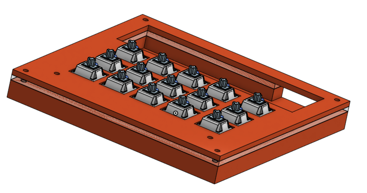

# Henry's Macropad

A macropad for common keybinds I use during CAD, programming, and art!

# BOM:
- 1x Seeed Studio XIAO SAMD21 (XIAO-Generic-Thruhole-14P-2.54-21X17.8MM)
- 1x PCB (PCB)
- 1x OLED_128x64 (SSD1306 128x64 OLED)
- 15x Keyswitch (SW_Cherry_MX_1.00u_PCB)
- 17x Diodes
- 10x WS2812B LEDs (LED_WS2812B)