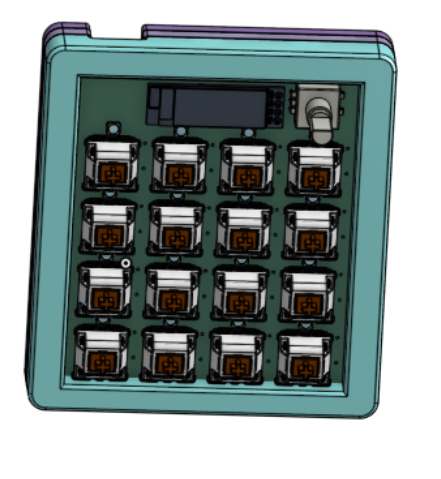
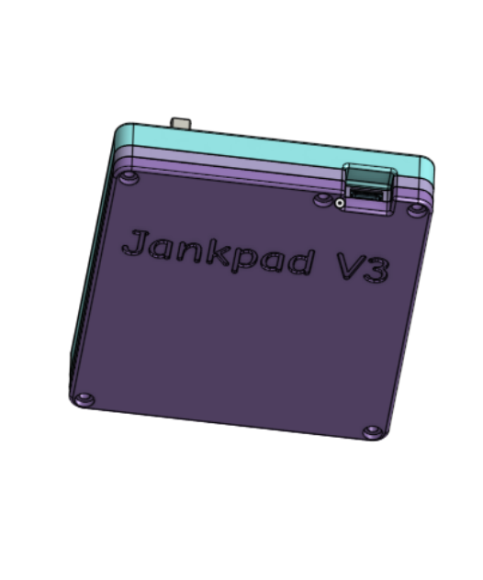
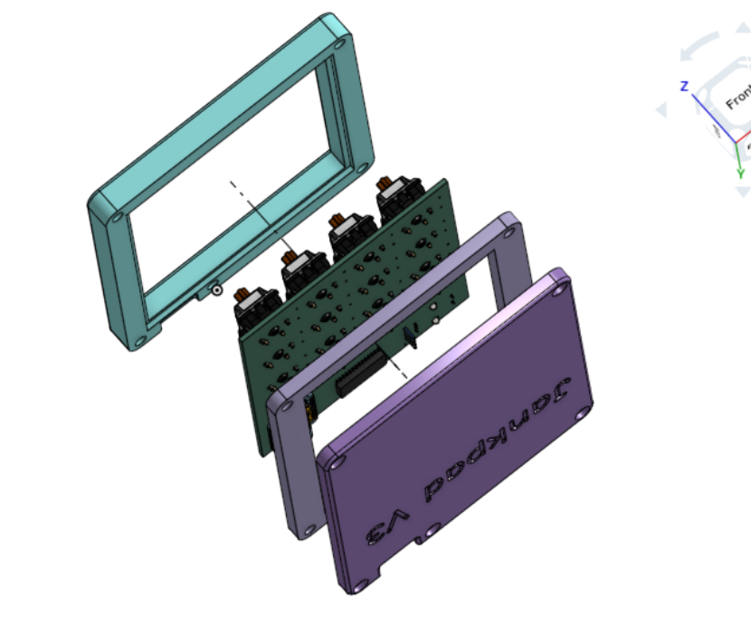
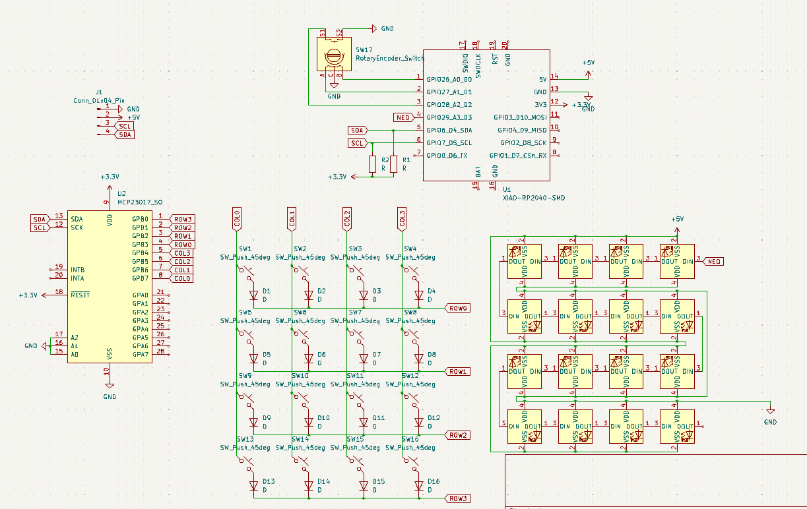
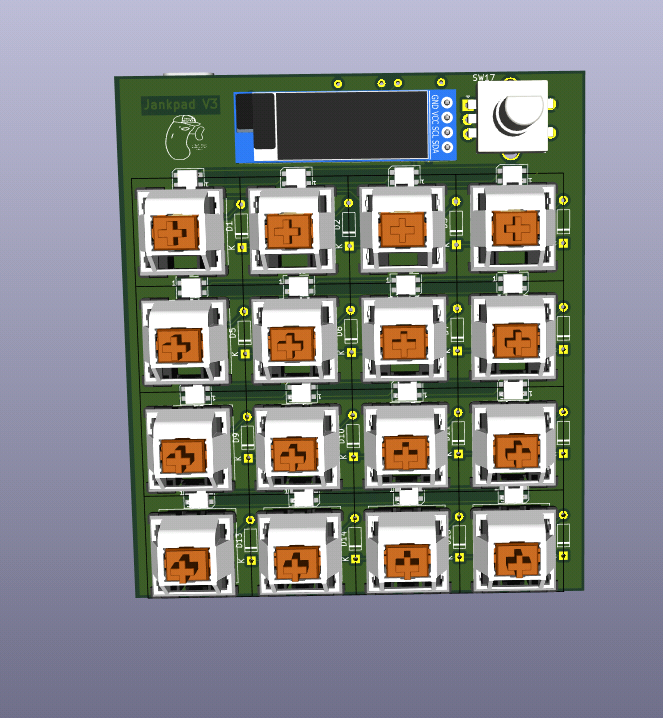
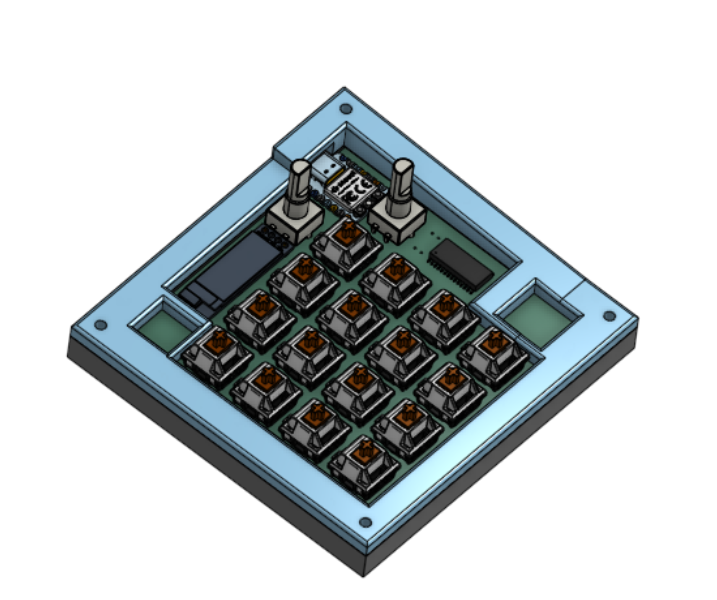

# Janky Macropad #

This is my hackpad submission!

It features a 128x32 OLED display, 16 MX switches, and a rotary switch, the case is seperated into two three parts connected by screws

# kicad library files #

[MX_V2](https://github.com/ai03-2725/MX_V2)

[OPL_Kicad_Library](https://github.com/Seeed-Studio/OPL_Kicad_Library)

[KiCad-SSD1306-0.91-OLED-4pin-128x32.pretty](https://github.com/gorbachev/KiCad-SSD1306-0.91-OLED-4pin-128x32.pretty.git)

# kicad 3d models #

[models](models.zip)

# Pretty PCB Pictures 

A 4x4 keyboard matrix is used to support 16 keys. An IO extender is used to give the XIAO enough pins to connect to the matrix and other components

# BOM #

## Keyboard ##

- 16 MX-Style Switches
- 16 Keycaps
- 1 EC11 Rotary encoder

## Case ##

3d prints @ [production/case](production/case)

- `bottom.stl`
- `middle.stl`
- `top.stl`

Misc

- 5 M3x16mm screws
- 10 M3x5mx4mm heatset inserts

## Electronics ## 
- PCB
- 1 Seeed XIAO RP2040 SMD
- 16 1N4148 Diodes
- 16 SK6812 LEDs
- 1 MCP23017
- 0.96 inch OLED

# Background #

I haven't every played with kicad or pcb design before, so this project presented the perfect oppurtunity for me to do just that!
I wanted to challenge myself by trying to route as many components as possible on my pcb, and so my first Jankpad had almost every item in the approved list. 

I tried doing this in one all nighter and I think I've gone insane, it's okay though because I have a really cool looking numpad design now :D

Jankpad V3 managed to slim down the design at the cost of a rotary encoder, as I learned that I could place components on the back side of the board.

I'm pretty proud of Jankpad V3, and it baffles me that I was able to go from never having touched kicad to having designed my own macropad from scratch in a span of two days

