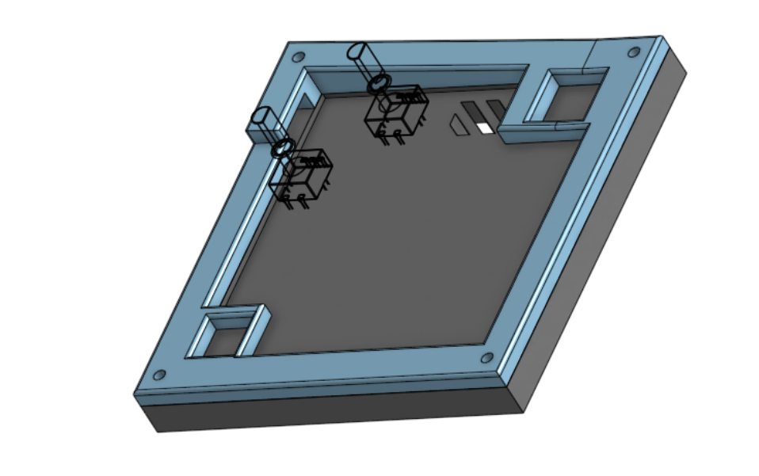

# Janky Macropad #

This is my hackpad submission! The jankpad is a macropad I made in 24 hours in a procrastination fueled frenzy.

It features a 128x32 OLED display, 16 MX switches, and 2 rotary switches, the case is seperated into two parts connected by four screws.

# PCB #

A 4x4 keyboard matrix is used to support 16 keys. An IO extender is used to give the XIAO enough pins to connect two rotary switches

# BOM #

- 3D printed top half
- 3D printed bottom half
- PCB
- Seeed XIAO RP2040 SMD
- 16 MX-Style Switches
- 16 Keycaps
- 2 EC11 Rotary encoders
- -0.96 inch OLED
- 4 M3x16mm screws
- 4 M3 hex nuts
