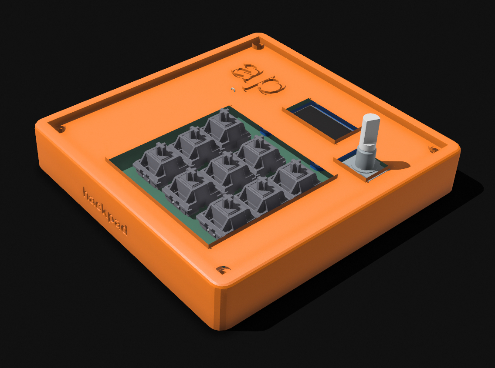
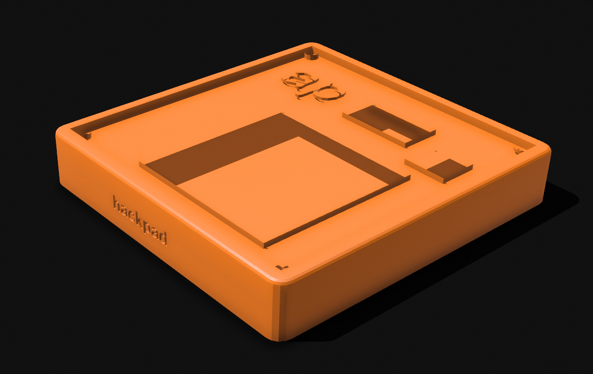
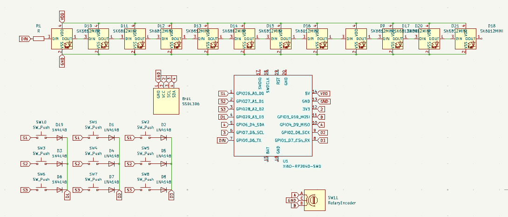
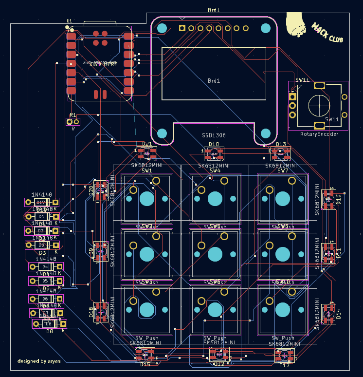

# LayersPad by Aryan Pathak
## The LayersPad is a 9-key macropad with a rotary encoder and a OLED display, with multiple layers of keybindings for everyone.

## Layers:
- Layer ZERO (default): 

SWITCH LAYERS, PERPLEXITY, YOUTUBE,

MOVE APP LEFT, SPOTLIGHT/RAYCAST, MOVE APP RIGHT

PREVIOUS, PLAY/PAUSE, NEXT

- Layer GAMING:

SWITCH LAYER, W, R,

A, S, D,

SPRINT, JUMP, CROUCH

- Layer DEVELOPER

SWITCH LAYER, COPY, PASTE,

MOVE APP LEFT, AI (command + K), MOVE APP RIGHT

COMMENT/UNCOMMENT, NEXT, PREVIOUS

- Layer ART (Procreate):

SWITCH LAYER, UNDO, REDO,

CUT, PASTE, SELECTION MODE

HSB, LAYERS, COLOR

*Each layer has a different artwork on the OLED display.*

## Bill Of Materials

**SSD1306 OLED display | 1

IN4148 THT diodes | 9

SK6812MINI LED | 12

Cherry MX switches (preferably blue) | 9

EC11 Rotary Encoder | 1

seeed studio XIAO RP2040 | 1**

## .UF2 FILE IS NOT IN THE FOLDERS, FIRMWARE IS IN "QMK-FIRMWARE" FOLDER, WITH RULES.MK, KEYMAP.C, AND CONFIG.H
my slack handle: aryan

This was my first time building something like this, and I enjoyed the entire process (although there were some frustrating challenges along the way :p)
The 3D model was made in Shapr3d, and the final version was the 3rd or 4th redesign, and the PCB wiring was the toughest part. My first PCB design was 19 mm too big, so i had to rewire it, then it was 2mm too big so i had to refit the tracks again haha. This is also my first PR so ths took AGES of experimenting too! At the end of the day, it's very satisfying to be finally making the PR :D
