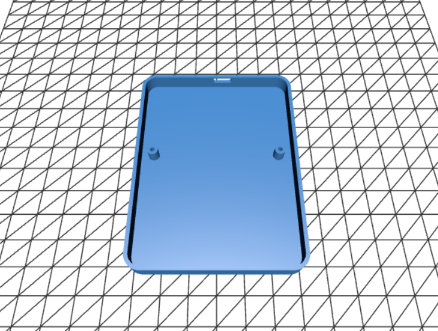

## Martucci Macropad

This prolly help me do my "repetitive tasks better", i think I have done well
runs on the KMK firmware (used python)
- rotary encoder
- oled screen
- led lights
BOM:
4  - 23-21UYOC/S530-A3/TR8

4- 150Ω

1  - Seeed XIAO RP2040

9  - 1N4007W

1  - HS91L02W2C01

9  - CHERRY_CHERRY_MX yellow

1  - PEC11R-4215F-S0024
PCB:

SCHEMATIC:

CASE:

