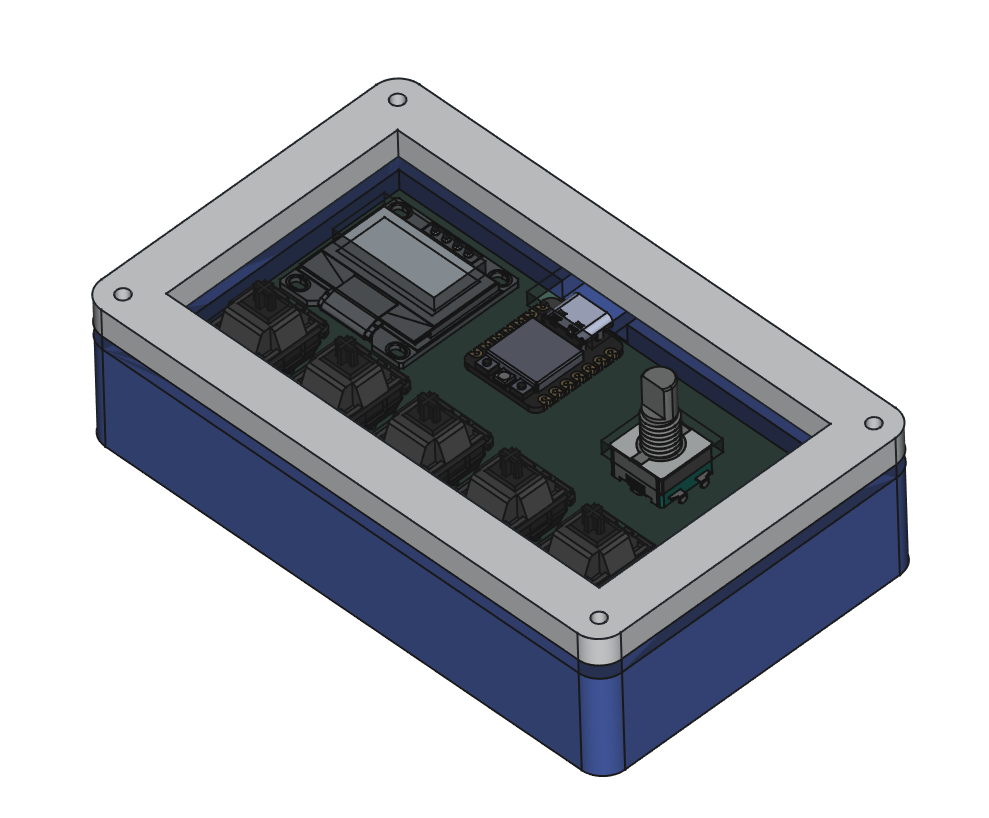
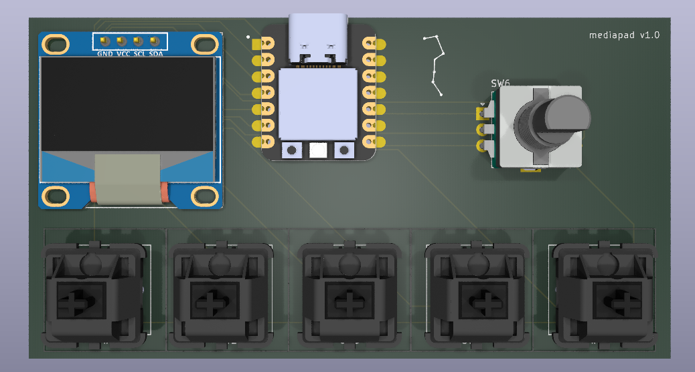
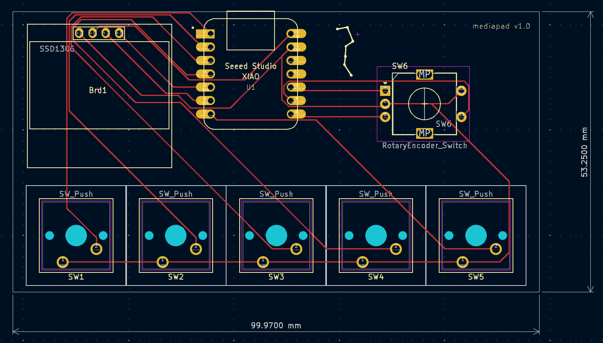

# mediapad

control your media with this nifty device
- pause/play key
- brightness up/down keys
- media forward/backward key
- rotary encoder to adjust volume
- runs on qmk

# BOM
- 5x Cherry MX switches
- 1x EC11 Encoder
- 1x PCB
- 1x I2C SSD1306 128x64 OLED

# Colours
- bottom: dark blue
- plate/middle: transparent (acrylic)
- top: white
