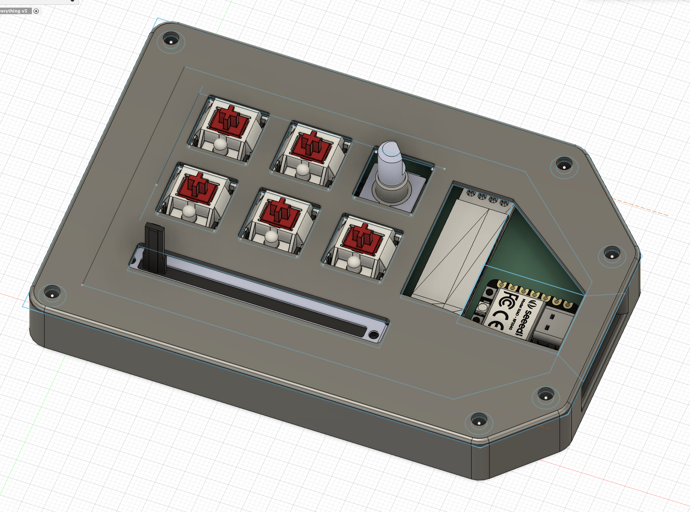

# meowpad
this is my submission for hackclub's hackpadv2 ysws.

i used kicad for the pcb, bricscad for the case, and kmk for the firmware

# inspiration
i saw the announcement talking about this ysws, and i thought it would be a great opportunity to learn 3d modelling and making pcbs  

# challenges
i had completely no exprience in making pcbs, or 3d models, so i was very confused by the software at the start.  
the fact that fusion360 was not available on linux, so i had to keep rebooting between macos and linux when i forget to get measurements was tough and demotivating  
(i dual boot linux and macos on my mac, and i barely had enough space for fusion360, so i couldnt install xicad on the macos partition)  
[my friend](https://github.com/uplre) saw me doing this and also wanted to start, so we ended up doing it together :3

# screenshots
## pcb

## case

# BOM:
- 5x cherry mx pink switches
- 1x ec11 encoder
- 1x pcb
- 6x through hole 1N4148 diodes
- 1x 100nF through hole capacitor
- 1x bourns inc. PTA4543-2215CPB103
- 1x SSD1306 OLED 128x32 (i2c Version)
- 5x white keycaps (please)
