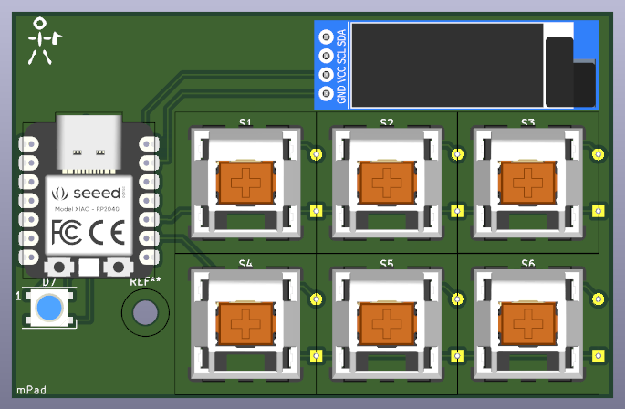
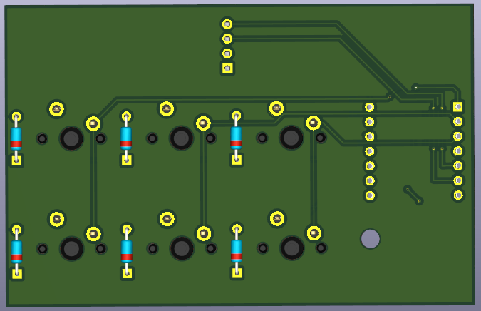

# Minpad

A simple 2x3 macro pad with a display!

Designing a case was difficult, as I barely have any cad experience, but the PCB was really fun! I'll definitely look into more projects like this later on.

## PCB

Front and back of the PCB, the whole board uses a fill zone.

## Bill of materials

| Component                  | Amount |
|----------------------------|--------|
| PCB                        | 1      |
| Cherry MX Switches         | 6      |
| Seeduino Xiao RP2040       | 1      |
| WS28128 LED                | 1      |
| Through-hole 1N4148 Diodes | 6      |
| OLED 128x32                | 1      |
| Keycaps                    | 6      |
