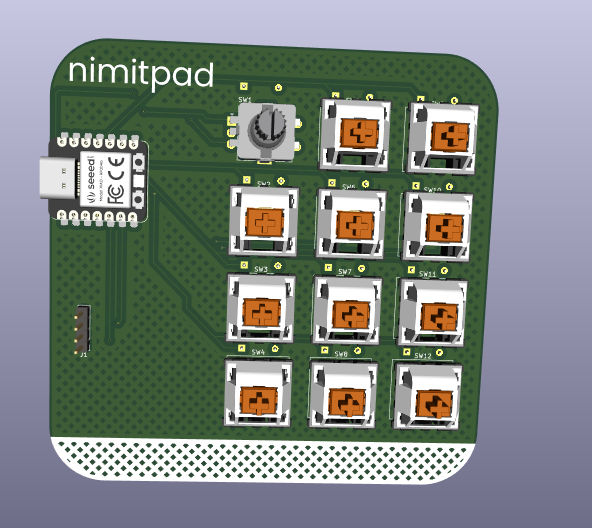
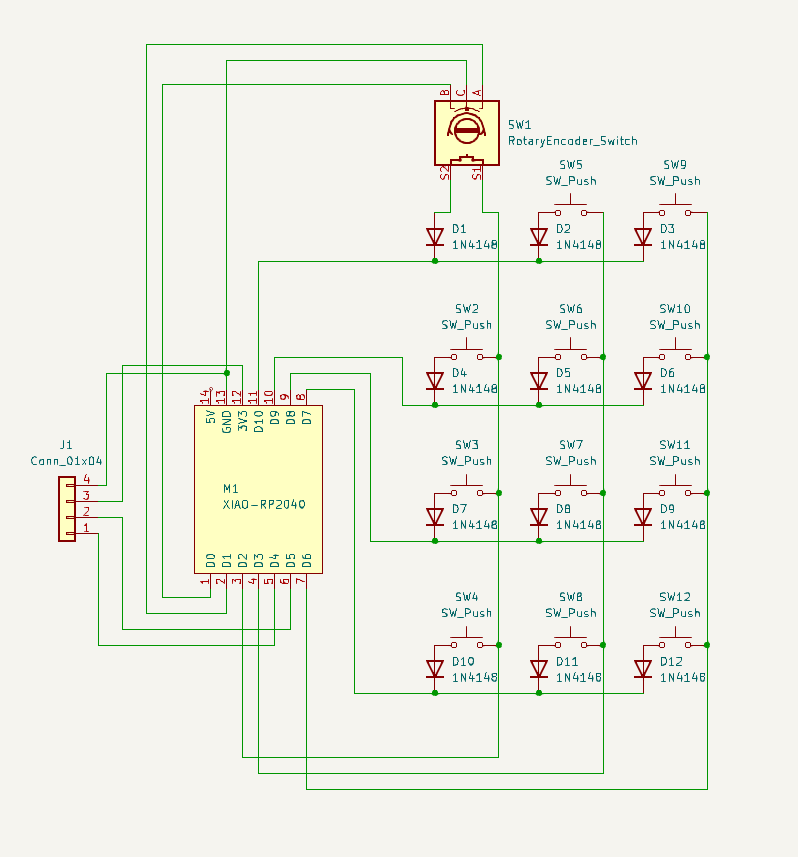
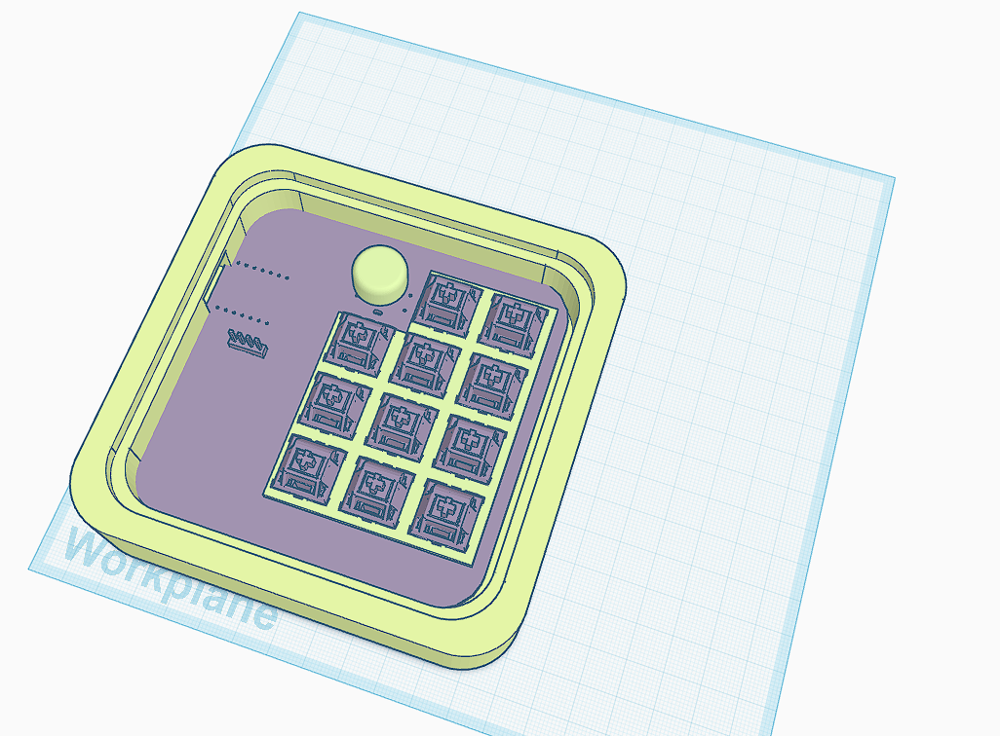

# nimitpad 2024

# BOM:
- 11x Cherry MX switches
- 1x EC11 Encoder
- 1x PCB (White) [dont forget]
- 1x Acrylic cover (3mm) [optional]
- 12x Through-hole 1N4148 Diodes
- 1x SSD1306 (0.96")
- SeeedStudio XIAO RP2040
- 1x Case (Prusament Lime)
'
# About:
Ever since i learnt you can quickly open apps on the taskbar by using the WIN key with the respective number, it's become a staple of my life. The keypad just helps do that a little easier! Additionally, I am a huge music fan so i need some dedicated media control keys. The remaining keys are placeholders for stuff I will setup in the future (Copy paste and save? Dedicated valorant keybinds? idk)
# Images:

- PCB

- Case and Plate

- Schematic

- All together!
