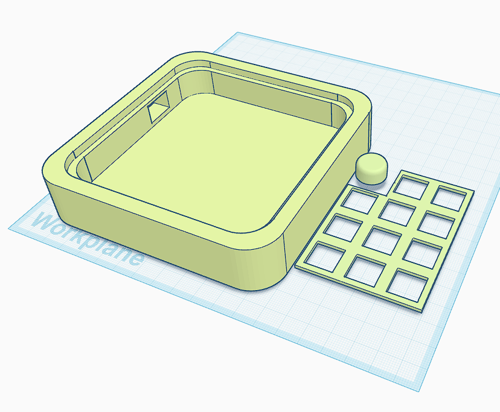

# nimitpad 2024

# BOM:
- 11x Cherry MX switches
- 1x EC11 Encoder
- 1x PCB (White) [dont forget]
- 1x Acrylic cover (3mm) [optional]
- 12x Through-hole 1N4148 Diodes
- 1x SSD1306 (0.96")
- SeeedStudio XIAO RP2040
- 1x Case (Prusament Lime)

# Images:

- PCB

- Case and Plate

- Schematic

- All together!
