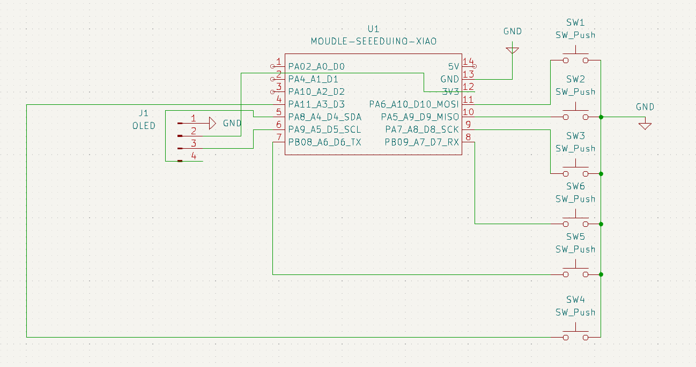
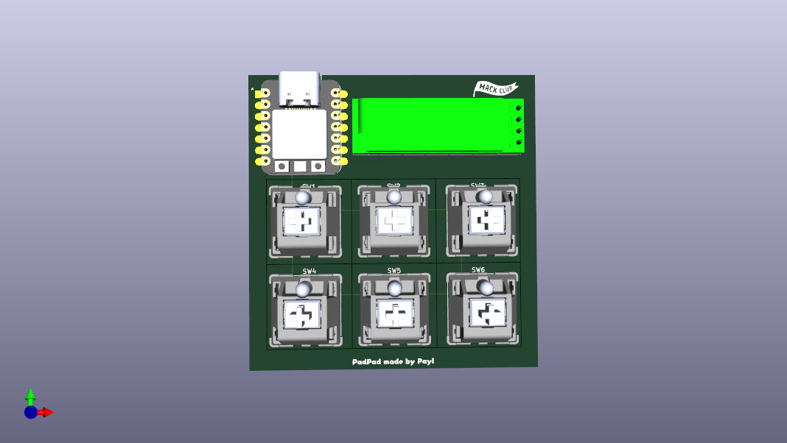
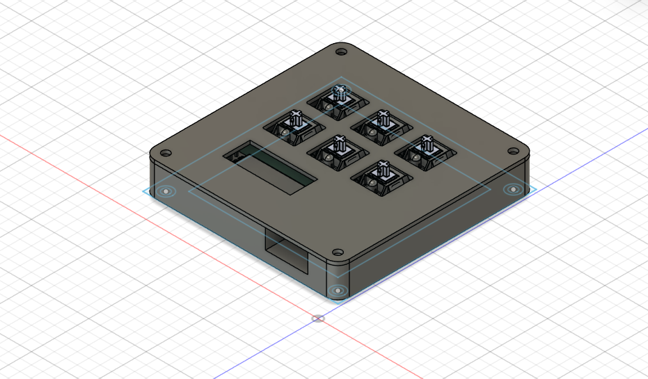
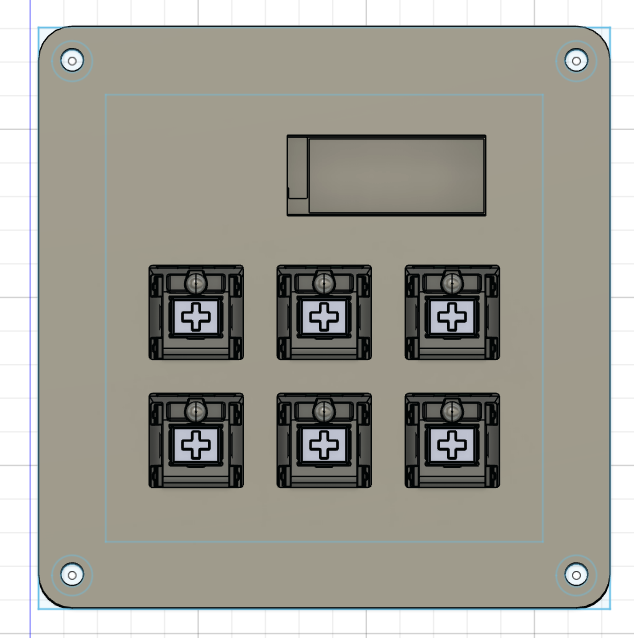
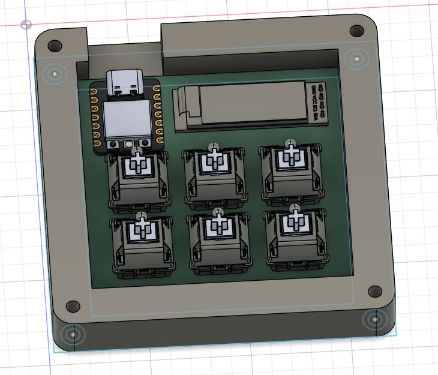

# ✨ PadPad ✨

A very simple macropad, it was my first time using KiCad and Fusion 360. The OLED display *should* be used to display current playing media.

# Photos
### Schematic :

### PCB :

### Case :

[BOM](./BOM.md)

Made by Paul (@Paylicier) with ❤️, KiCad and Fusion