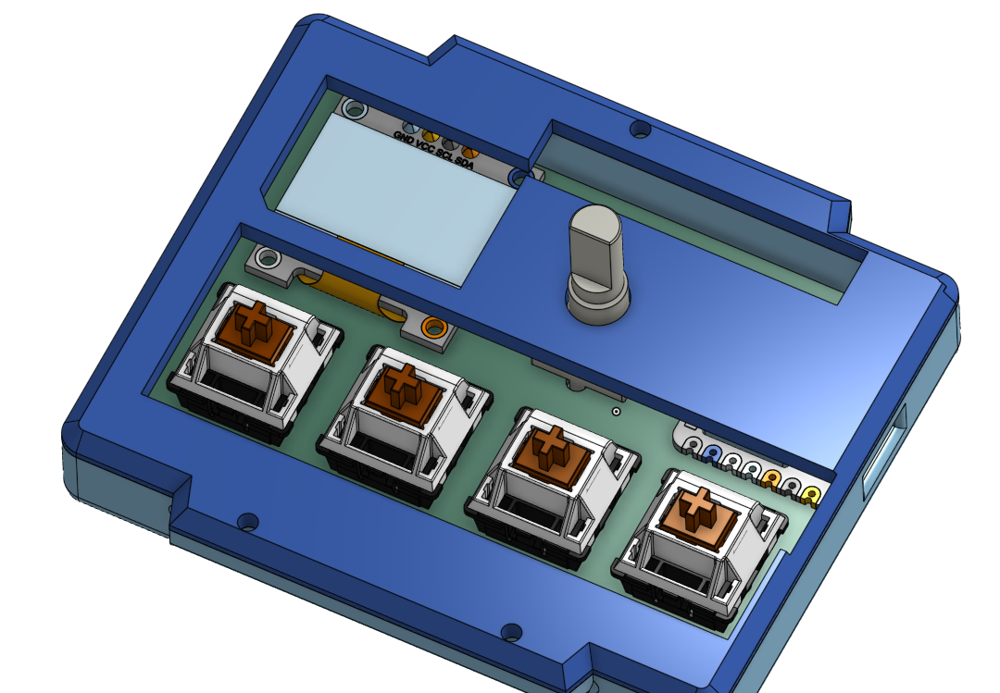
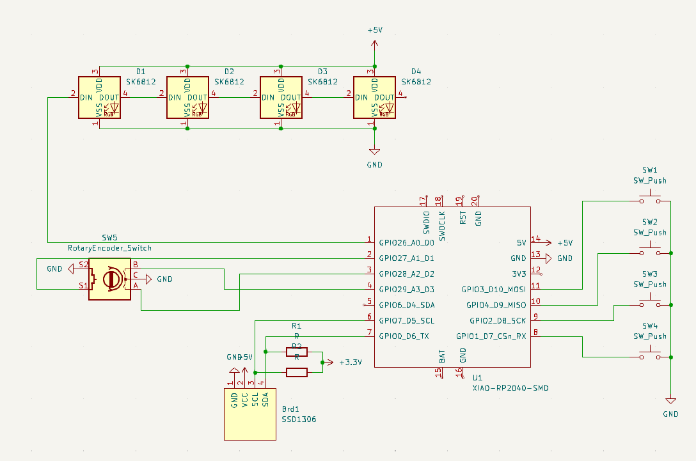
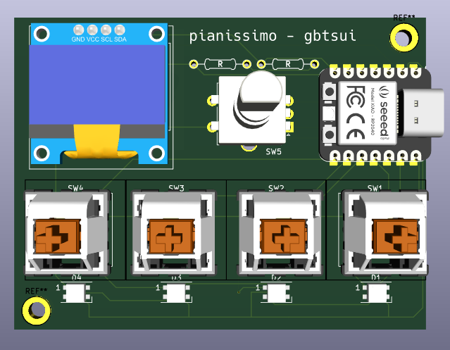
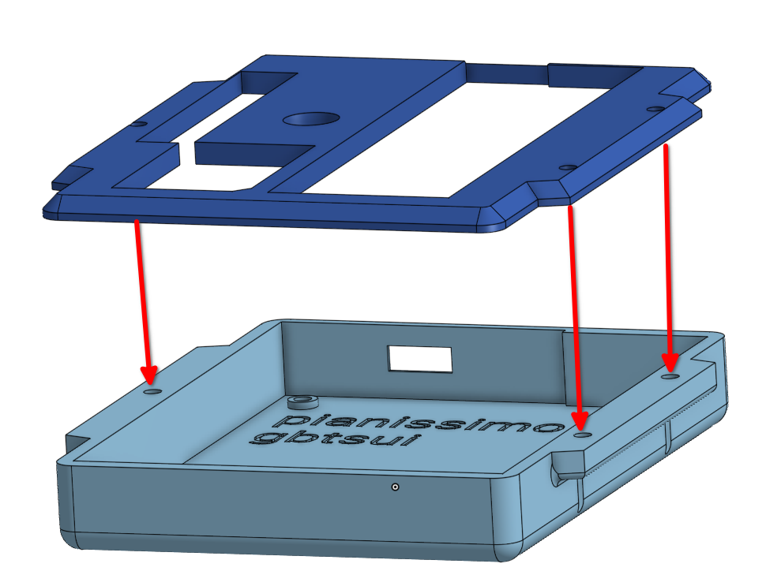
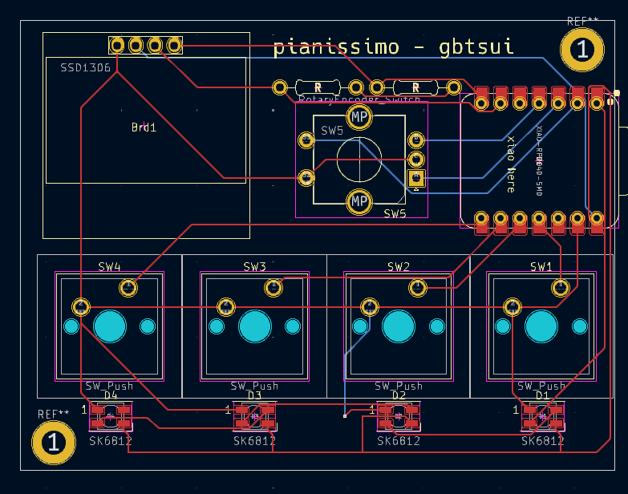

# pianissimo
A small macropad designed for Osu!Mania, but can be used for basically anything.
(I don't actually play Osu at all, I just thought it would be a fun challenge.)
This is the first thing that I've ever made a PCB or CAD for, so it's probably pretty bad.
It's kind of fun though.

Learning how to wire the PCB felt like those ads of really simple puzzles
in mobile games and watching the player fail at what is clearly a simple
problem, except I was the player. I eventually figured out how to wire 
everything together in a way that isn't horrific, but it's probably
still going to be highly suboptimal.

## Manufacturing Instructions
1. 3D print the case. I have no clue what tolerances are required, sorry.
It'll probably work no matter what you do.
2. Wire in the PCB.
3. Put some keycaps on it.
4. Plug it in and hope the firmware works.

## Mappings
Currently, there's no way to change mappings other than editing `main.py`. Sorry :/

As of Feb 13, though:

- `f`
- `g`
- `h`
- `j`

Rotary Encoder: `volume up/down`

Encoder Switch: `volume mute`

## Bill of Materials
- 4x: MX1 Switch
- 1x: EC11E Rotary Encoder
- 5x: M3x16mm Screw
- 4x: SK8612-MINI-E LEDs
- 1x: 0.96" SSD1306 Display
- 2x: 4.7kOhm Resistor
- 1x: XIAO RP2040
- 4x: DSA Keycaps
- 1x: Pianissimo PCB

## Screenshots

