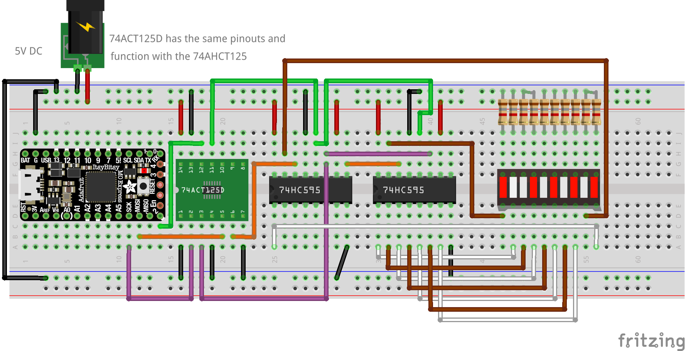
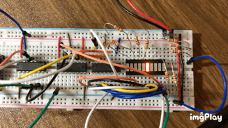

# About

The example here shows the wiring and codes for daisy-chained shift registers.

The following items are used:
- Two Shift Registers: [74HC595](https://www.adafruit.com/product/450)
- One Level Shifter: [74AHCT125](https://www.adafruit.com/product/1787)
- One LED Display: [10 Segment Light Bar LED](https://www.adafruit.com/product/1815)
- One microcontroller board: [ItsyBitsy M0 Express](https://www.adafruit.com/product/3727)

In addition, some other items are needed as well:
- Through-hole 2K Resistor: [CFR-25JR-52-2K](https://www.digikey.com/en/products/detail/yageo/CFR-25JR-52-2K/11981)
- Jumper wires

The idea is to let the microcontroller to communicate with the shift registers through SPI, and then control 10 LEDs.
The level shifter **74AHCT125** helps to translate 3.3V signal to 5.0V, since this example is trying to use 5.0V to drive LEDs and chips.
If one uses 3.3V for all LEDs and chips, the level shifter is not going to be needed.

For the daisy chain connection, this guide, [SPI interface Tutorial](https://www.best-microcontroller-projects.com/spi-interface.html), can provide some basic ideas.
The guide, [Serial to Parallel Shifting-Out with a 74HC595](https://www.arduino.cc/en/Tutorial/Foundations/ShiftOut), can also provide some connection details for the 74HC595 chip.

# Wiring

With the board `Itsy Bitsy M0 Express`, pins can be connected as follows:



In the wiring, the ItsyBitsy M0 is not powered, given that one can power it up through USB cable when programming it.

Also, one may notice that, for the first 8 LEDs (from left to right), the pins from the 74HC595 at the *end* of the daisy chain are fully utilized, which means that the end of the daisy chain is actually the first device, the index 0 device.

Therefore,
- for pin index 0~7, the value will be sent to the device at the end of the daisy chain
- for pin index 8~15, the value will be sent to the device the second end of the daisy chain (which is the head of the daisy chain in this example)

# Coding

The example code can be found in `74hc595_daisy_chain.py`.
Here are some notes about the codes:

## Import Modules

```python
import time
import board
import digitalio
import adafruit_74hc595
```

## Instantiate Class

One need to provide the number of shift registers when instantiating the class.

```python
# note: D2 port is close to SCK and MOSI pins for Itsy Bitsy M0
latch_pin = digitalio.DigitalInOut(board.D2)
sr = adafruit_74hc595.ShiftRegister74HC595(board.SPI(), latch_pin, number_of_shift_registers=2)

shift_register_pin_num = 10
shift_register_pins = [sr.get_pin(n) for n in range(shift_register_pin_num)]
```

## Do Something with the Pins

One simple example is to blink all LEDs together:

```python
while True:
    # turn all LEDs on
    for i in range(shift_register_pin_num):
        shift_register_pins[i].value = True
    time.sleep(0.5)

    # turn all LEDs off
    for i in range(shift_register_pin_num):
        shift_register_pins[i].value = False
    time.sleep(0.5)
```

A more complicated example is to turn on/off each LEDs one-by-one:
```python
bar_ind_current = 0 # current index
shift_register_pins[bar_ind_current].value = True

while True:
    # iterate through every LED
    bar_ind_last = bar_ind_current
    bar_ind_current = bar_ind_last + 1
    if bar_ind_current <= (shift_register_pin_num-1):
        shift_register_pins[bar_ind_last].value = False
        shift_register_pins[bar_ind_current].value = True
    else:
        bar_ind_current = 0
        shift_register_pins[bar_ind_last].value = False
        shift_register_pins[bar_ind_current].value = True
    time.sleep(0.1)
```

Here is the result one can get:


