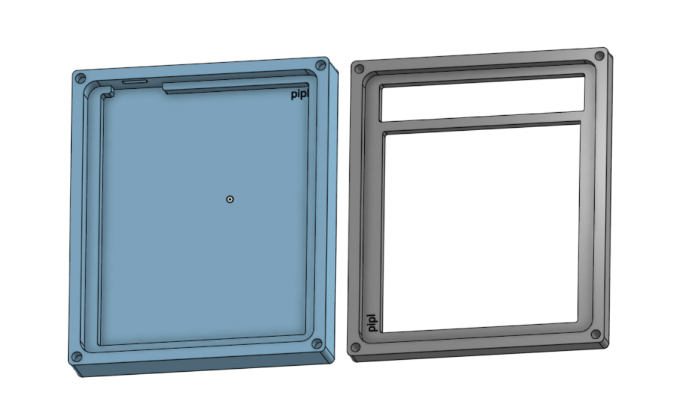

# piplHackpad

yet another keypad lmao, may reprogram in the future  
by `@pipl`, id `U07V3MD8BPW`  
`/pcb/` contains the kicad files  
`/firmware/` contains the qmk firmware files  
`/cad/` contains 3d print files - I have a 3d printer, will print for myself  
`/production/` contains production files, including the .uf2, 3d print files, and gerbers files  
  
### bom:
 - 15 MX cherry red switches (+ a spare if possible)
 - 16 1n4148 diodes - through hole
 - 1 ec11 rotary encoder with switch
 - 1 xiao rp2040 - can you include through hole pins on the side?
 - 1 pcb (black please! if not possible, any color works)
 - 1 usbA to usbC cable 
 - 15 blue keycaps (+ a spare if possible)
 - 1 encoder knob, blue
 - 8 m3x5mx4mm heatset inserts
 - 8 m3x16mm screws
 - 4 m3 hex nuts
 - and something extra you think i might like :)

### pictures
<table>
<tr>
<td> render1</td>
<td> render2</td>
</tr>
<tr>
<td> schematic</td>
<td> traces</td>
</tr>
<tr>
<td> assembly</td>
<td> case</td>
</tr>
</table>
