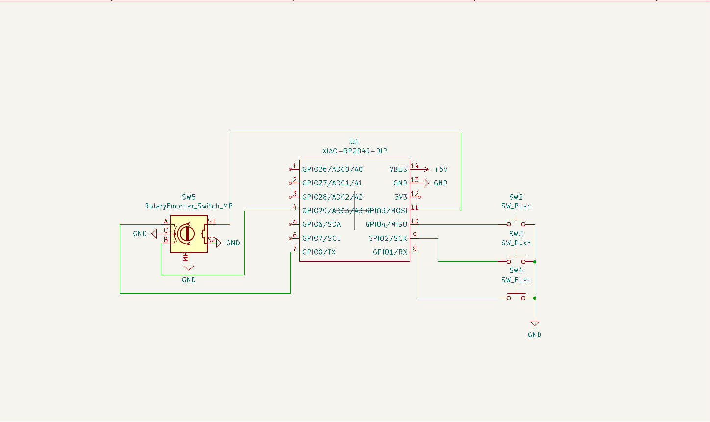
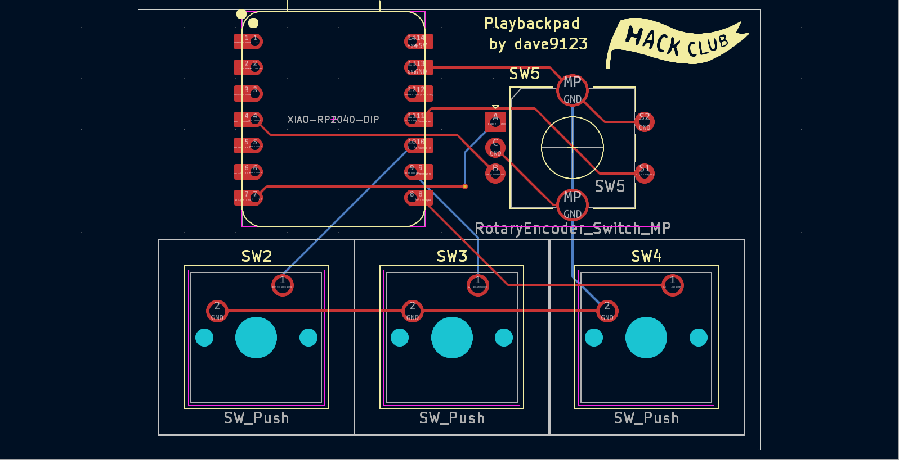
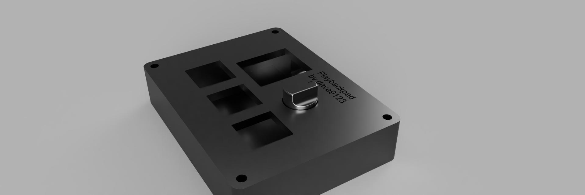

# Playbackpad

A pad with a rotary encoder and 3 switches to control playback and volume. I made this because it's painful to go to the app and click on pause every time it's my time to talk in a meeting <i>yes I listen to music while meeting 😁</i>.

## PCB

I quite enjoyed the PCB making process even though it was painful to find libraries for the OLED so I didn't use it.

Schematics | PCB
:--------: | :-:
 | 

## CAD

Made the casing with Fusion 360, quite painful to make the holes ngl 💀🙏

## Firmware

Made it with KMK firmware, the rotary encoder for volume, the switch on the rotary encoder for mute/unmute, the left key for previous, the middle key for play/pause, the right key for next.

## BOM

- 3 Cherry MX switches
- 3 Black Blank DSA keycaps
- 4 M3x0.5x16 mm screws
- 1 Seeed XIAO RP2040
- 3D printed case