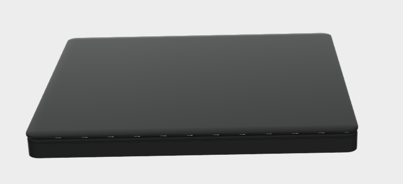
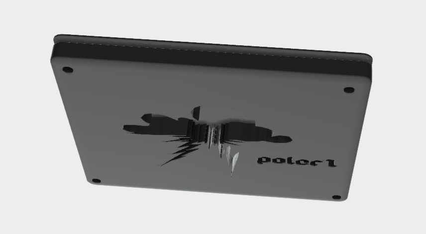

# poler1
- This is a macropad totally built from scratch and has anti ghosting 6 switches.
---
## Inspiration
My insipiration were the popular small macropads on tiktok that are used to play osu. Using this opportunity I wanted to go all out with specs and design and that is what I did. Also, I made it arcane themed ;)

## Challenges
I have no clue how I have managed to build the case for it. It was extremely challenging because I dont have the physical board to measure. I managed to build a really simple design which protects the base of PCB and also avoid the damage incase of a drop lol.

## Specifications

### BOM
1. PCB in white color
2. Seeed XIAO RP2040
3. 6 Gateron Jupiter Red Switches
4. 6 Blank Keycaps (Black Color)
5. 16 SK6812 MINI-E LEDs
6. 4 M3x16mm screws
7. 4 M3 hex nuts
8. 6 Through-hole 1N4148 Diodes
9. Soldering Iron
10. Pin Cutter
11. 0.96 inch OLED display
12. EC11 Rotary encoders

### Others
- PCB Color: White
- KMK Firmware
- Base.stl

### Top View

### Bottom View

Schematic            |  PCB         |   Case
:-------------------------:|:-------------------------:|:-------------------------:|
    |    | 

