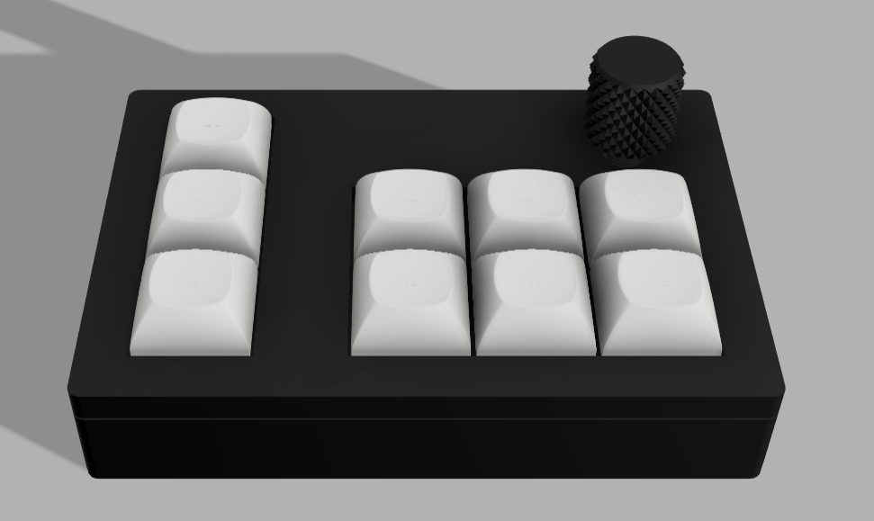

# Premiere Pad
## Basic macropad used for premiere pro shortcuts very cool and customisable
- This is part of a YSWS limited time program hosted by hackclub 

# BOM:
- 9x MX Gateron Milky Yellows
- 9x Blank DSA keycaps
- 1x EC11 Encoder
- 1x Seeed XIAO RP2040
- 1x PCB
- 10x Through-hole 1N4148 Diodes
- 4x M2 x 5mm Screws
- 4x M2 x 16mm Screws
- Black PLA

Note: Flip over knob when printing

# Features:
- 6 main customisable keys
- 3 different profiles ( allowing up to 18 different keybinds! )
- Timeline knob with movement and start/pause capability
- Clean and compact design to fit anywhere

# Instructions:
1. Print out PCB using gerbers in production/gerbers.zip
2. 3D print all 4 stl files in production/case
3. Flash Micropython onto microcontroller (find a video for this that can explain how to much better), a new drive will appear on your computer when done
4. Drag the python file in firmware/KMK/code.py into the new drive and save
5. Attach pcb to plate by clicking in switches so flush with plate and secure
6. Screw plate onto the top of the casing with the 4 x 5mm screws
7. Screw bottom casing to top casing with the other 4 x 16mm screws
8. Enjoy your macropad

# Extras:
- If you want to edit the keybinds to do something else simply go into the code.py file in the drive mounted and edit the keybinds, it shouldnt be too difficult to understand and just changing some letters is required
- You can also flash other firmware onto the micropcb but none provided yet 

