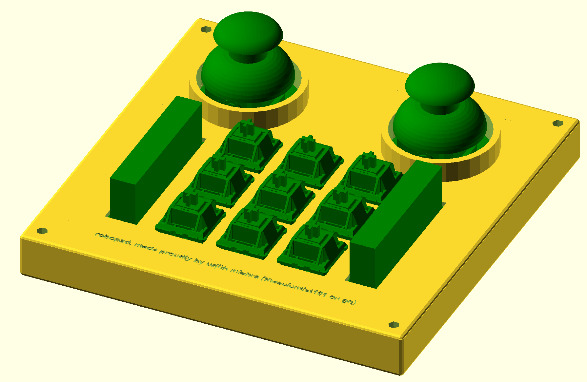
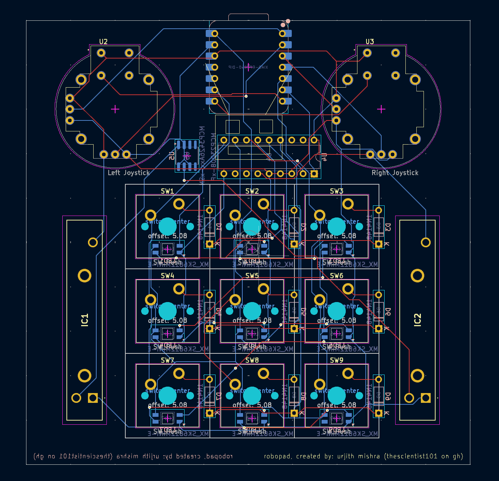

# Robopad

The Robopad was designed because no controllers are mapped correctly for robot simulation. The main features I needed were the two joysticks but I decided to add some sliders to allow me to control the brightness of my screen and some keyswitches to allow me to have more inputs when I need them. Along with the keyswitches, I added some LEDs which will (hopefully) make the macropad look cooler.

## Features

- 2 Joysticks
- 2 Sliders
- 9 Key Switches
- 9 LEDs

## CAD Model

The case was designed using OpenSCAD and fits together using 4 M3 screws which go into threaded inserts. The case is designed to be 3D printed and the files can be found in the `case` and `production` folders.

## PCB

My PCB was made in Kicad. It consists of the XIAO Seeed RP2040 microcontroller, 2 joysticks, 2 sliders, 9 keyswitches, and 9 LEDs. The PCB was designed to be 2 layers and the files can be found in the `pcb` folder.

Schematic:\

PCB:\

## Firmware

The firware was written in Python using KMK and some Adafruit HID stuff. I have a couple different random configurations for the keyswitches. The joysticks should appear as joysticks when plugged in to the computer, and the sliders should change volume and brightness.

## BOM

Stuff from Hackclub:

- 9x Cherry MX Switches
- 9x DSA Keycaps
- 4x M3x5x4 Heatset inserts
- 4X M3x16mm SHCS Bolts
- 9x 1N4148 DO-35 Diodes.
- 9x SK6812MINI-E LEDs
- 1x XIAO RP2040
- 1x Case (2 printed parts)

Stuff from the $20 Grant:

- 1x PCB (black from JLCPCB)
  - $2.00 fabrication + $1.50 shipping + $0.29 tax = $3.79
- 2x Joystick ([from aliexpress](https://www.aliexpress.us/item/3256807502491570.html?spm=a2g0o.cart.0.0.5f2f38daBj3AgQ&mp=1&pdp_npi=5%40dis%21USD%21USD%202.92%21USD%202.68%21%21%21%21%21%402103201917401184935476465efd24%2112000041983052805%21ct%21US%216221086412%21%211%210&_gl=1*zre4f*_gcl_aw*R0NMLjE3NDAwODAxMjkuQ2owS0NRaUF3dHU5QmhDOEFSSXNBSTlKSGFrRzQxQkk3cFFCNklUdUVZb0tieW1SSmxpVThvZzV0THo5OG0wWGpPelNsVjNZTUhob0pQMGFBcldPRUFMd193Y0I.*_gcl_dc*R0NMLjE3NDAwODAxMjkuQ2owS0NRaUF3dHU5QmhDOEFSSXNBSTlKSGFrRzQxQkk3cFFCNklUdUVZb0tieW1SSmxpVThvZzV0THo5OG0wWGpPelNsVjNZTUhob0pQMGFBcldPRUFMd193Y0I.*_gcl_au*MTE3ODQ3NjYwMy4xNzM4MzUzNDQ5*_ga*NTQwNjc0MjM3LjE3MzgzNTM0NDk.*_ga_VED1YSGNC7*MTc0MDExODMxOC4yMC4xLjE3NDAxMTg1NzIuMzguMC4w&gatewayAdapt=glo2usa))
  - $2.92 (2 in one pack)
- 2x Slider ([from aliexpress](https://www.aliexpress.us/item/2255800687104982.html?spm=a2g0o.cart.0.0.5f2f38daBj3AgQ&mp=1&pdp_npi=5%40dis%21USD%21USD%202.00%21USD%201.62%21%21%21%21%21%402103201917401184935476465efd24%2110000010056121148%21ct%21US%216221086412%21%212%210&_gl=1*1mt7dhr*_gcl_aw*R0NMLjE3NDAwODAxMjkuQ2owS0NRaUF3dHU5QmhDOEFSSXNBSTlKSGFrRzQxQkk3cFFCNklUdUVZb0tieW1SSmxpVThvZzV0THo5OG0wWGpPelNsVjNZTUhob0pQMGFBcldPRUFMd193Y0I.*_gcl_dc*R0NMLjE3NDAwODAxMjkuQ2owS0NRaUF3dHU5QmhDOEFSSXNBSTlKSGFrRzQxQkk3cFFCNklUdUVZb0tieW1SSmxpVThvZzV0THo5OG0wWGpPelNsVjNZTUhob0pQMGFBcldPRUFMd193Y0I.*_gcl_au*MTE3ODQ3NjYwMy4xNzM4MzUzNDQ5*_ga*NTQwNjc0MjM3LjE3MzgzNTM0NDk.*_ga_VED1YSGNC7*MTc0MDExODMxOC4yMC4xLjE3NDAxMTg2NTEuNDIuMC4w&gatewayAdapt=glo2usa))
  - $1.62 \* 2 + $3.66 shipping = $6.90
- 1x MCP3426 I2C ADC ([from aliexpress](https://www.aliexpress.us/item/3256806640672476.html?spm=a2g0o.cart.0.0.5f2f38daBj3AgQ&mp=1&pdp_npi=5%40dis%21USD%21USD%202.38%21USD%202.27%21%21%21%21%21%402103201917401184935476465efd24%2112000038429688044%21ct%21US%216221086412%21%211%210&_gl=1*fbhyet*_gcl_aw*R0NMLjE3NDAwODAxMjkuQ2owS0NRaUF3dHU5QmhDOEFSSXNBSTlKSGFrRzQxQkk3cFFCNklUdUVZb0tieW1SSmxpVThvZzV0THo5OG0wWGpPelNsVjNZTUhob0pQMGFBcldPRUFMd193Y0I.*_gcl_dc*R0NMLjE3NDAwODAxMjkuQ2owS0NRaUF3dHU5QmhDOEFSSXNBSTlKSGFrRzQxQkk3cFFCNklUdUVZb0tieW1SSmxpVThvZzV0THo5OG0wWGpPelNsVjNZTUhob0pQMGFBcldPRUFMd193Y0I.*_gcl_au*MTE3ODQ3NjYwMy4xNzM4MzUzNDQ5*_ga*NTQwNjc0MjM3LjE3MzgzNTM0NDk.*_ga_VED1YSGNC7*MTc0MDExODMxOC4yMC4xLjE3NDAxMTg0OTMuNDQuMC4w&gatewayAdapt=glo2usa))
  - $2.38
- 1x MCP23008 I2C GPIO Expander ([from aliexpress](https://www.aliexpress.us/item/2251832814785988.html?spm=a2g0o.cart.0.0.5f2f38daBj3AgQ&mp=1&pdp_npi=5%40dis%21USD%21USD%202.87%21USD%200.99%21%21%21%21%21%402103201917401184935476465efd24%2167065260410%21ct%21US%216221086412%21%211%210&_gl=1*1c9ndtu*_gcl_aw*R0NMLjE3NDAwODAxMjkuQ2owS0NRaUF3dHU5QmhDOEFSSXNBSTlKSGFrRzQxQkk3cFFCNklUdUVZb0tieW1SSmxpVThvZzV0THo5OG0wWGpPelNsVjNZTUhob0pQMGFBcldPRUFMd193Y0I.*_gcl_dc*R0NMLjE3NDAwODAxMjkuQ2owS0NRaUF3dHU5QmhDOEFSSXNBSTlKSGFrRzQxQkk3cFFCNklUdUVZb0tieW1SSmxpVThvZzV0THo5OG0wWGpPelNsVjNZTUhob0pQMGFBcldPRUFMd193Y0I.*_gcl_au*MTE3ODQ3NjYwMy4xNzM4MzUzNDQ5*_ga*NTQwNjc0MjM3LjE3MzgzNTM0NDk.*_ga_VED1YSGNC7*MTc0MDExODMxOC4yMC4xLjE3NDAxMTg1MzQuMy4wLjA.&gatewayAdapt=glo2usa))
  - $2.87

Tax from Aliexpress: ($6.90 + $2.38 + $2.87 + $2.92) \* 0.0825 = $1.52
Total: $3.79 + $6.90 + $2.38 + $2.87 + $2.92 + $1.52 + $3.79 = $23.17

If the sales and the stars align I will be able to fit this in the $20 budget. If not, I will pay the extra $3.17.
