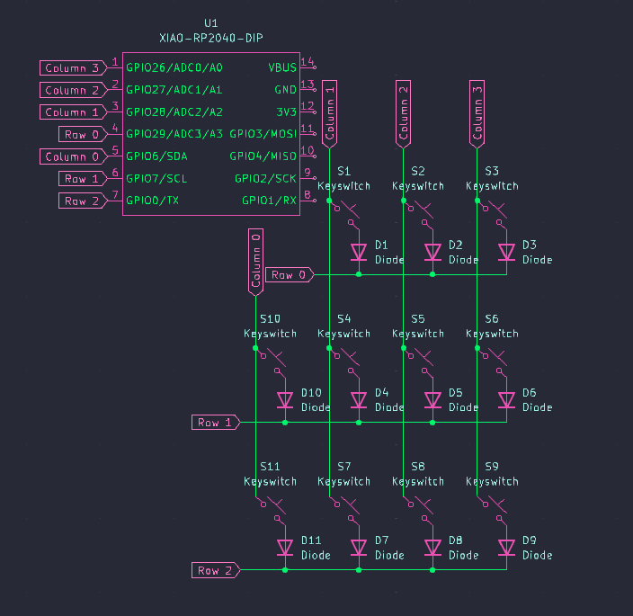
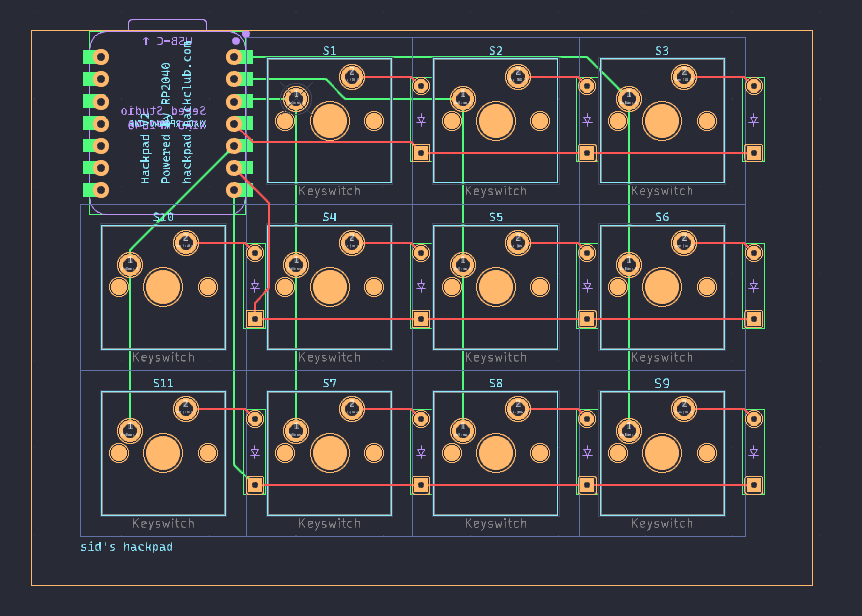

# Sid's Hackpad
My hackpad has 11 switches to be the most useless modifier keys just because.   
I'll probably figure out how it best fits into my workflow as I use it.
Though I was new to both KiCad and Fusion, designing the case in Fusion was definitely the most challenging part of the project.
However, it was also really rewarding to understand how these different softwares work and be able to help others complete their hackpad as well.

# Key features:
* 11 MX switches
* Uh yeah thats it

# Images:
Fully assembled:            
               
Schematic:          
                           
PCB:            
                                                    
Case:           
                              
                                             
                                                            

# CAD/case:
There are just 4 screw holes which will use M5 bolts and heatset inserts at the bottom to hold the 2 pieces together.

# PCB:
The PCB uses a matrix to prevent ghosting on any of the 11 keys.

# Firmware:
I used KMK for the firmware. Currently, the firmware is just a bunch of modifier keys, but once I think more about what would be useful for me I will change it.

# BOM:
##### Item (qty) - comments
   
Seeed Studio XIAO RP2040 (1)                        
Cherry MX style switches (11)                           
1N4148 diodes (11)                              
1U Keycaps (11) - no color preference                                 
M3x16mm bolts (4)                                 
M3 heatset inserts (4)                                    
Case (1) - no color preference                                    
