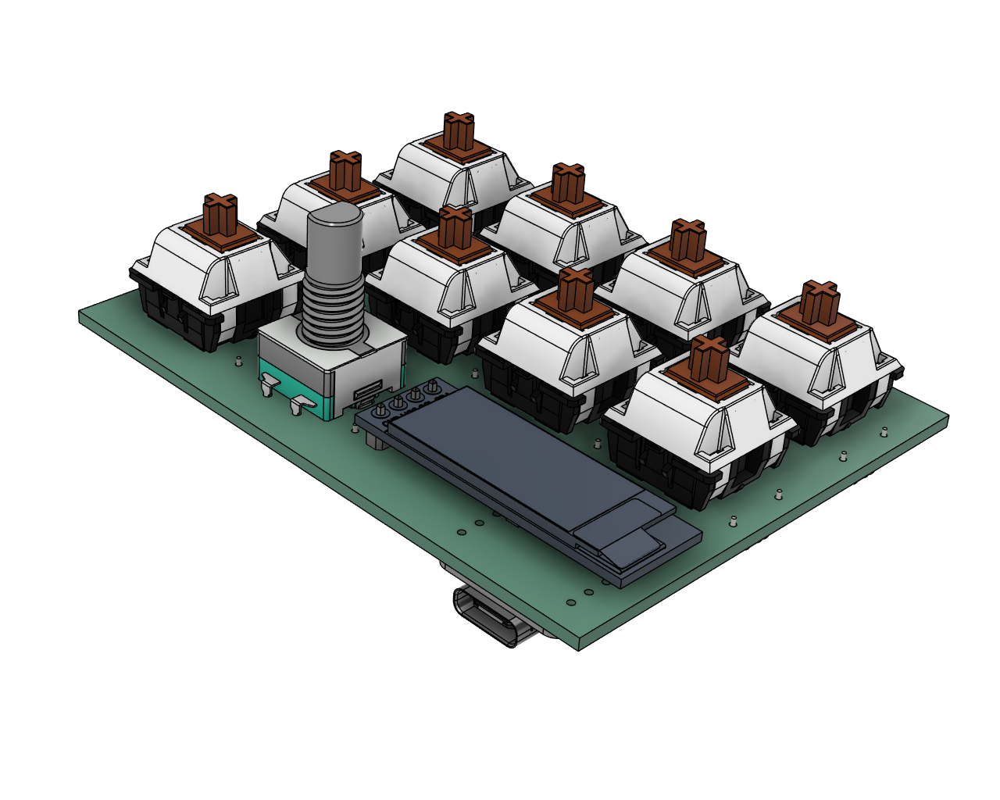
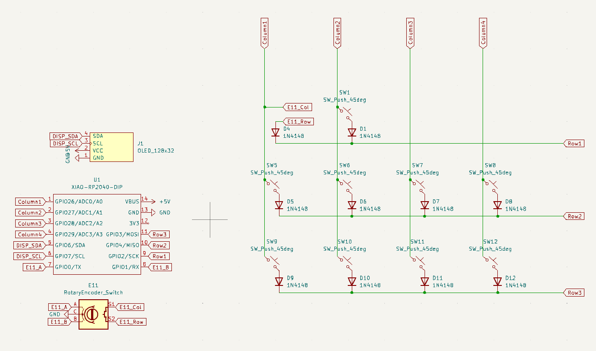
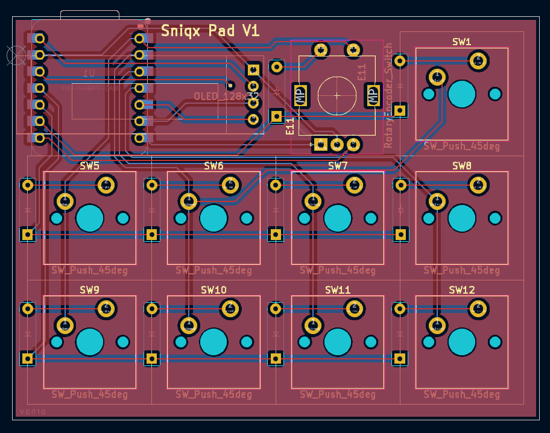
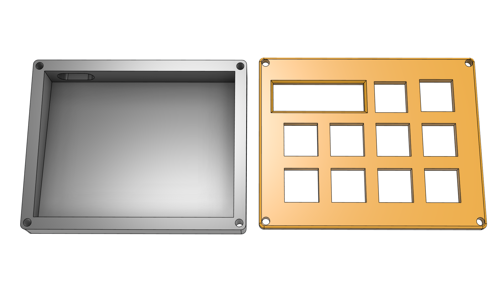

# Sniqx Pad V1

A Versatile Macro Pad with a rotary encoder and OLED display.

## Inspiration
Wanted to make a macropad which looks simple yet elegant and a bit of unsymmetry with that single key on top.

## Challenges
The PCB design and finding the right footprints and symbols were quite a challenge. Rest after that was quite normal.

## Specifications

### BOM
- 9x Cherry MX Switches
- 9x Blank DSA Keycaps (1x Red, 2x White, 6x Black)
- 1x Rotary Encoder
- 1x 128x32 OLED Display
- 10x 1N4148 Diodes
- 1x XIAO RP2040
- 4x M3x16 Bolt

### Other Resources
- [PCB](PCB)
- [CAD Models](CAD)
- [Firmware](Firmware)
- [Images](images)

|             Schematic              |          PCB           |           Case           |
| :--------------------------------: | :--------------------: | :----------------------: |
|  |  |  |

## Author
- [Arnav Kumar](https://github.com/arnav-kr)