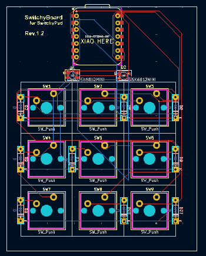
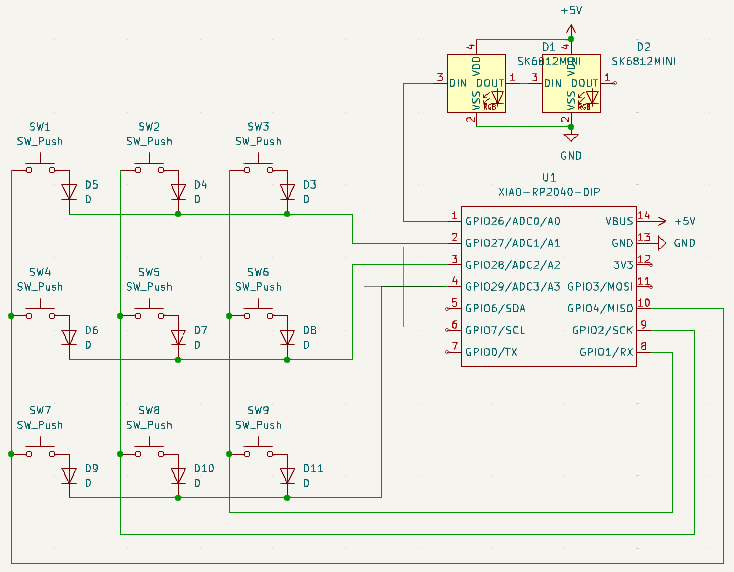
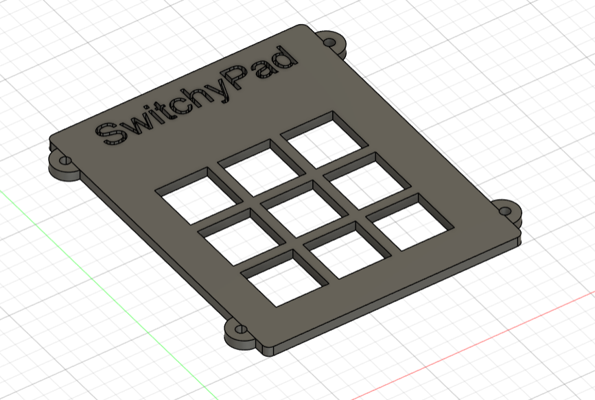
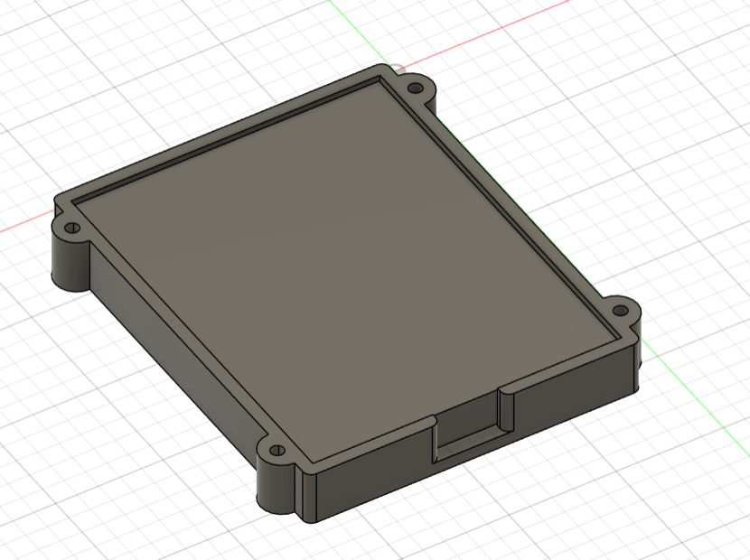

# SwitchyPad
Made for hackpad v2

## Features
- 9 hackable buttons that you can program to do whatever you want
- 2 neopixel LEDs
- Firmware written with kmk

...and that's it! Do you need anything more? :)

## Why
I always wanted a macropad, but found them too expensive and unaffordable. So when I saw this opportunity, I instantly said yes and started designing.

## PCB
Some photos:

## The case
The case was designed in Fusion 360, and I think it turned out pretty sick! Take a look:

## Firmware
Initially, I wanted to port QMK, but when I wanted to compile the code my installation of QMK MSYS got corrupted, so I went with kmk for this. However I might try QMK again once I get the parts.

## BOM
Also available in BOM.md.
| Footprint                              | Quantity | Designation     |
|----------------------------------------|----------|-----------------|
| SW_Cherry_MX_1.00u_PCB                 | 9        | SW_Push         |
| LED_SK6812MINI_PLCC4_3.5x3.5mm_P1.75mm | 2        | SK6812MINI      |
| XIAO-RP2040-DIP                        | 1        | XIAO-RP2040-DIP |
| D_DO-35_SOD27_P7.62mm_Horizontal       | 9        | 1N4148          |

