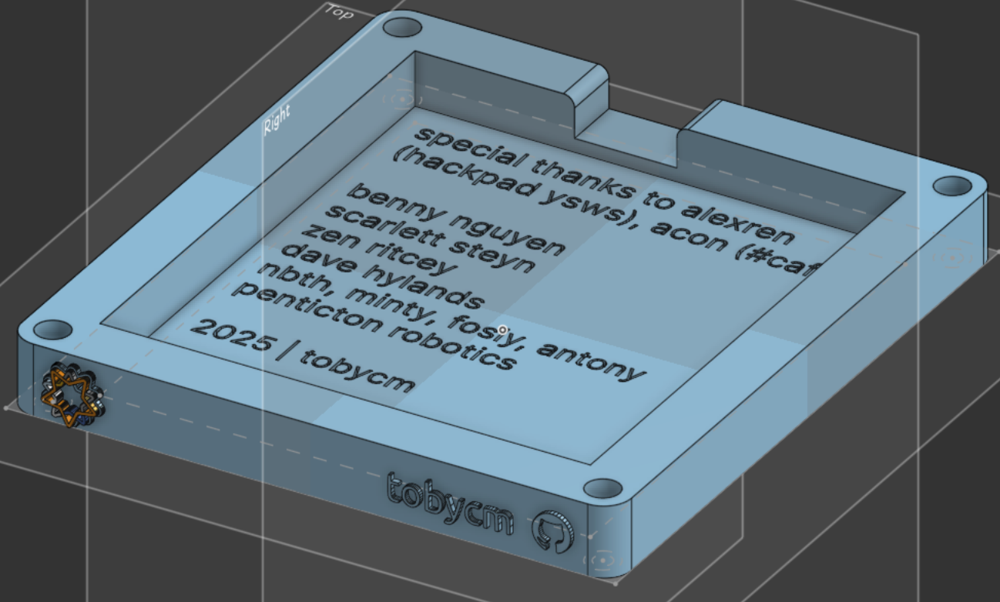

---
runme:
  id: 01JN0WNC339XBG3HPCGNCHPFSG
  version: v3
---

# Toby's Hackpad

simple hackpad to teach me how to make schematics, design PCBs, and write firmware for the RP2040.

thank you deeply to @dhylands for mentoring me through this process. i learned so much small tips for the encoders, i2c, switches, neopixels, etc.

## CAD Model:

speedran the CAD model in Onshape. i love onshape.

## PCB

pcb made in kicad, very nice software that works great with linux too! learned how to make my own symbols for an external display!!!

Schematic:

PCB:

## Firmware Overview

using kmk for the firmware. primitive at the moment but planning to make extensions through the spare gpio pins in the future.

- the rotary encoder changes volume!
- VIA support soon!

## BOM:

| Id  | Designator                                      | Footprint                                           | Quantity | Designation          | Supplier and ref |
|-----|------------------------------------------------|-----------------------------------------------------|----------|----------------------|------------------|
| 1   | DISPLAY1                                      | PinHeader_1x08_P2.54mm_Vertical                    | 1        | ~                    |                  |
| 2   | D6,D11,D9,D10,D12,D5,D7,D8,D4,D3,D1,D2       | LED_SK6812MINI_PLCC4_3.5x3.5mm_P1.75mm             | 12       | SK6812MINI           |                  |
| 3   | SW6,SW7,SW3,SW5,SW10,SW8,SW2,SW4,SW9,SW1     | SW_Cherry_MX_1.00u_PCB                             | 10       | SW_Push              |                  |
| 4   | C2                                           | C_0603_1608Metric_Pad1.08x0.95mm_HandSolder        | 1        | 100nF                |                  |
| 5   | U2                                           | SOIC-28W_7.5x17.9mm_P1.27mm                        | 1        | MCP23017_SO          |                  |
| 6   | J1                                           | PinSocket_1x06_P2.54mm_Vertical                    | 1        | Conn_01x06_Pin       |                  |
| 7   | C4,C3,C5,C6,C1                               | C_0603_1608Metric_Pad1.08x0.95mm_HandSolder        | 5        | 1uF                  |                  |
| 8   | R1,R2                                        | R_0603_1608Metric_Pad0.98x0.95mm_HandSolder        | 2        | 4.7K                 |                  |
| 9   | U1                                           | XIAO-RP2040-DIP                                    | 1        | XIAO-RP2040-DIP      |                  |
| 10  | SW11                                         | RotaryEncoder_Alps_EC11E-Switch_Vertical_H20mm_CircularMountingHoles | 1 | RotaryEncoder_Switch | |

please refer to [bom.csv](./bom.csv) for the full list of components.

## Smol fact

i joined acon speedrunning session on the last day before the deadline and it was pretty fun to listen to someone yapping while i work on my hackpad lol.
