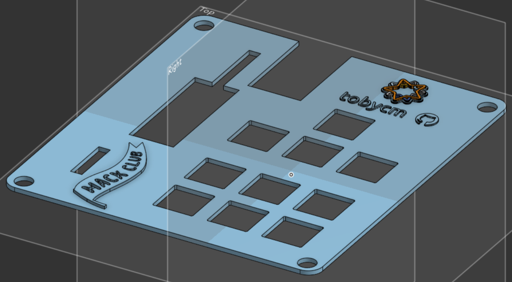

---
runme:
  id: 01JN0WNC339XBG3HPCGNCHPFSG
  version: v3
---

# Toby's Hackpad

simple hackpad to teach me how to make schematics, design PCBs, and write firmware for the RP2040.

thank you deeply to @dhylands for mentoring me through this process. i learned so much small tips for the encoders, i2c, switches, neopixels, etc.

## CAD Model:

speedran the CAD model in Onshape. i love onshape.

## PCB

pcb made in kicad, very nice software that works great with linux too! learned how to make my own symbols for an external display!!!

Schematic:

PCB:

## Assembled preview

## Firmware Overview

using kmk for the firmware. primitive at the moment but planning to make extensions through the spare gpio pins in the future.

- the rotary encoder changes volume!
- VIA support soon!

## BOM:

| Quantity | Part                                 |
|----------|--------------------------------------|
| 1        | PinHeader_1x16_P2.54mm_Vertical      |
| 12       | LED_SK6812MINI_PLCC4                 |
| 10       | SW_Cherry_MX                         |
| 1        | C-100nF-0603                         |
| 1        | MCP23017_SO                          |
| 5        | C-1uF-0603                           |
| 2        | R-4.7K-0603                          |
| 1        | XIAO-RP2040-DIP                      |
| 1        | RotaryEncoder_Alps_EC11E-Switch      |

please refer to [bom.csv](./bom.csv) for the full list of components.

## Smol fact

i joined acon speedrunning session on the last day before the deadline and it was pretty fun to listen to someone yapping while i work on my hackpad lol.
