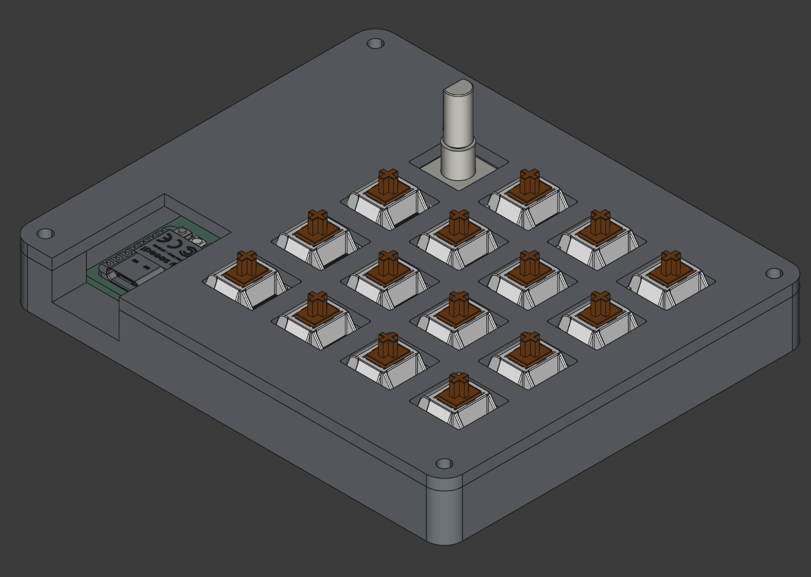
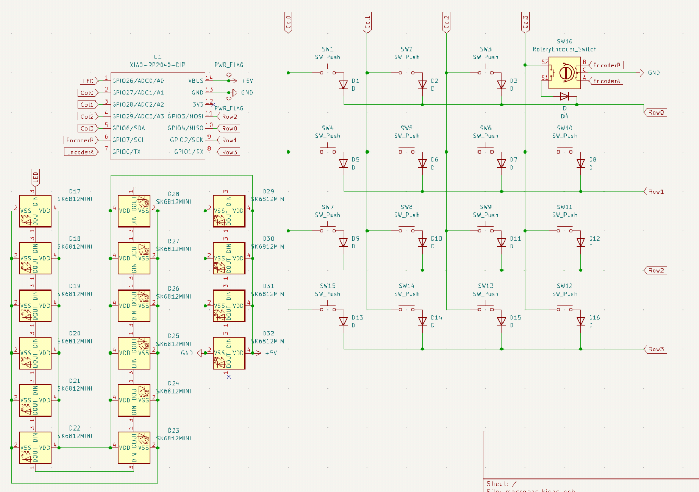
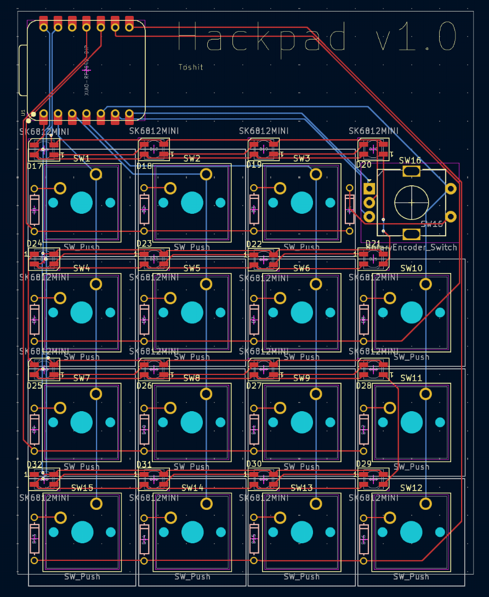

# Toshit's macropad

Made for Hackpad v2.

## Features
- 16 neopixels above each key
- 15 switches
- 1 rotary encoder

## Screenshots

## BOM
- 1x SEEEDUINO XIAO RP2040
- 15x Cherry MX switches
- 15x white keycaps
- 1x EC11 rotary encoder
- 16x SK6812MINI neopixels
- 16x 1N4148 diodes
- 4x screws & bolts that match Cyao's FreeCAD tutorial
    - I don't know which ones they are but they are probably the ones from cyaopad
