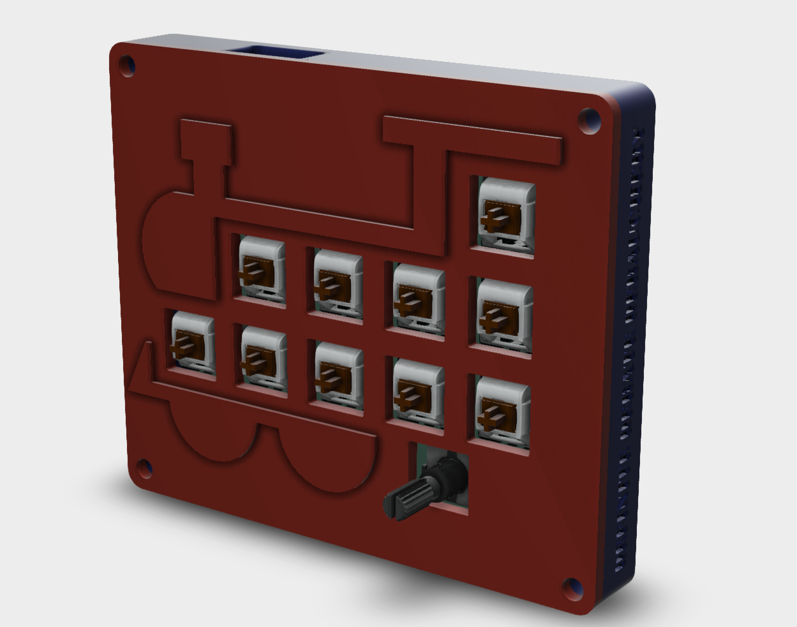

# Trainpad
This is my first attempt at a macropad, I decided to approach it from a train theme for something fun. It comes with a case that resembles a train, 10 keys and 1 encoder.

Figuring out firmware and PCB design took my a while, as particularly with the PCB, it was my first foray into its design.

Thanks for Hack Club for running.

# BOM:
- 10x Cherry MX switches
- 1x Xiao Seeed RP2040
- 1x EC11 Encoder
- 1x PCB
- 10x Through-hole 1N4148 Diodes
- 10x SK6812-E LEDs
- 1x 500ohm thru-hole resistor
- 10x Blank DSA Key Caps