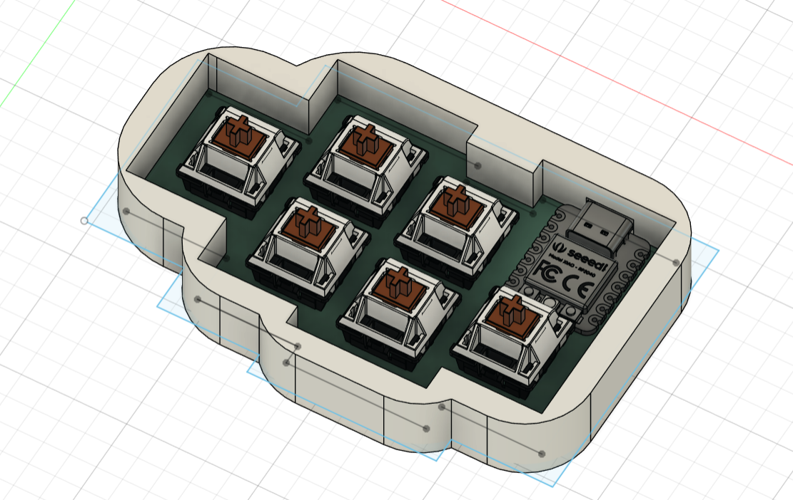
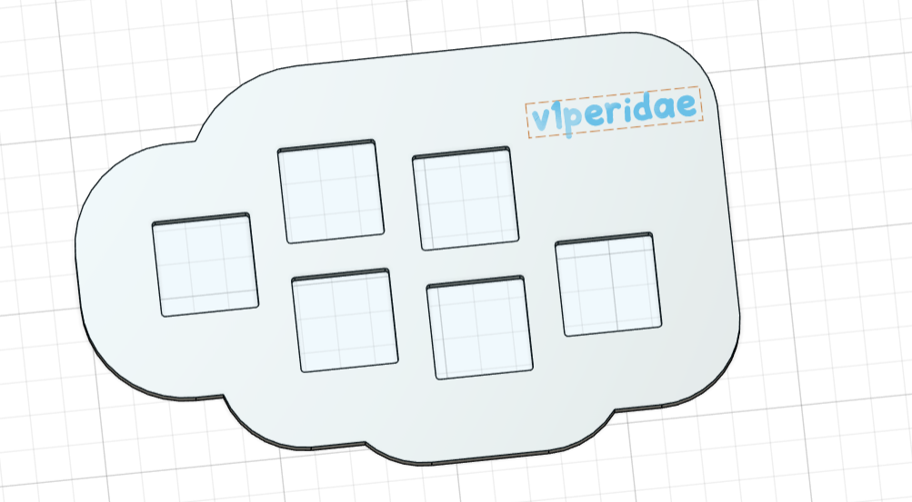
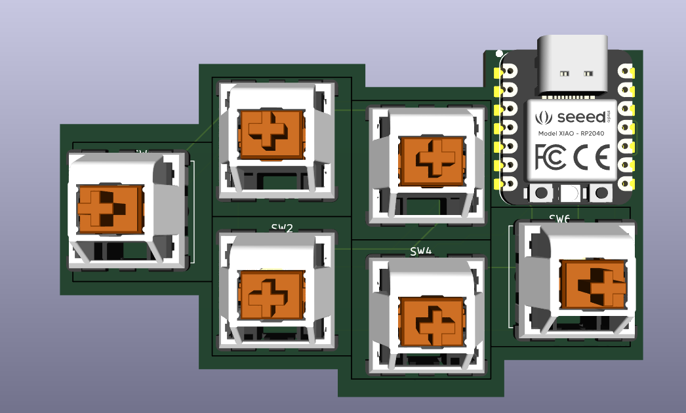

# v1perkeeb

## BOM

| Component             | Quantity | Notes                        |
| --------------------- | -------- | ---------------------------- |
| SEEEDUINO XIAO RP2040 | 1        | Microcontroller board        |
| MX Switches           | 6        | Mechanical keyboard switches |

**Note:** The actual PCB board is smaller than shown in the screenshots. There was an issue in the design which i fixed up but the Fusion 360 screenshots may not correctly show the gap I added with final dimensions.
**Challenges:** Ahhhhh Making the case
**Inspo:** Cloud :P

