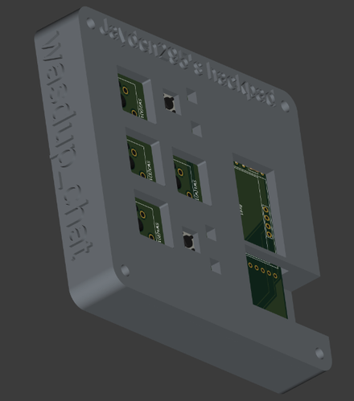
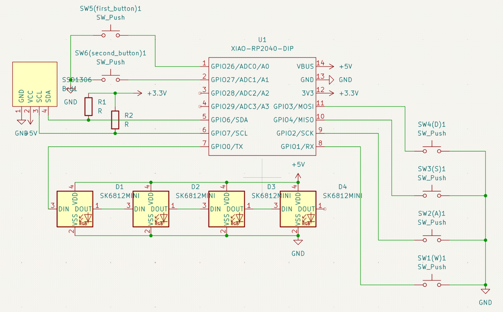
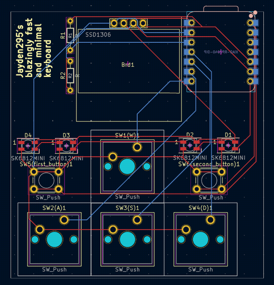
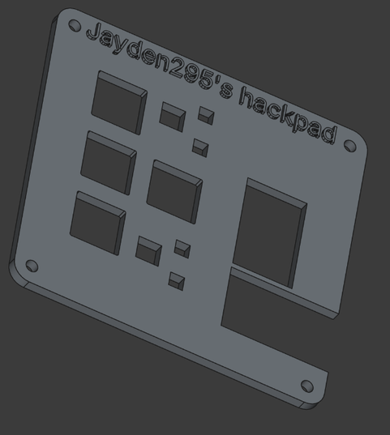
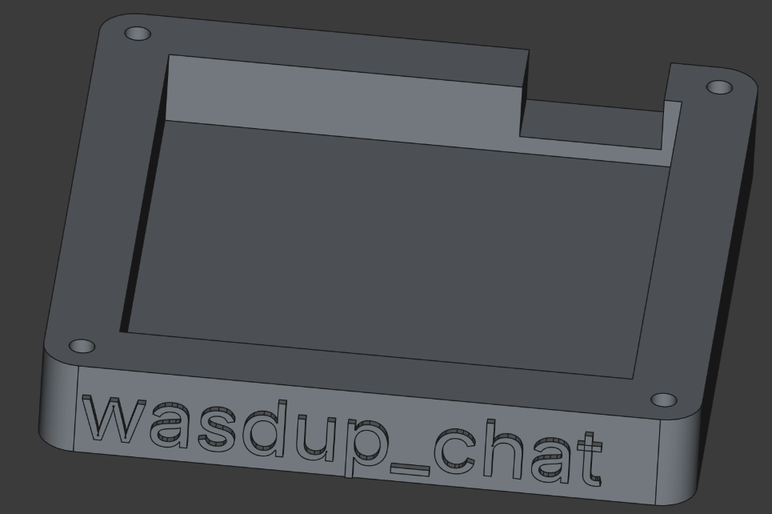

# wasdup-pad

[Project repository](https://codeberg.org/Jayden295/wasdup-pad)

My first keyboard, made with the WASD keys. It has a OLED 0.96" screen,
two buttons, and 4 LEDs.

It was made for/I used the [Hackpad guides](https://hackpad.hackclub.com/advancedguide)
to make this.

A little bit rushed, because I didn't manage the deadlines well and started working on
this one week before it ended.

[BOM available here.](./BOM.md)

## the keyboard

### PCB

I think that one issue with my schematic is that the LED's are
connected together so they will continously display the same thing...

This PCB/schematic was made using KiCad, I removed the ground plane from the
PCB picture so that you can see the circuits more easily. The real PCB still
has the ground plane.

### CAD model

I think that I might have done something wrong with the upper plate, since
when I look at it on the top it seems a bit misaligned, I hope it will be fine
though.

The whole case has been made using FreeCAD (yay free software!).

### "behind the scenes"

So, I started this project a week before the deadline (I started it on the 9th february,
deadline was 16th february), and submitted it the day that it the deadline passed
(16th february).

This didn't leave me much time to make this, and thus there are some issues here and there,
it's not the most polished thing ever. This was quite interesting, it forced me to learn
by forcing me to do things even though I didn't think this was the "best" way to do it.

1 day before the deadline, when I had the PCB and CAD almost done, I got another idea for
the hackpad, instead of it just being WASD keys (how unoriginal), I wanted to make it
like a sound player control (control the audio of microphone/pc, next/previous buttons,
pause button, oled screen to say current music).

Unfortunately, I didn't have enough time to finish that and decided I had to continue with
the current idea.

You might be wondering why I started this so late, it was in my todolist, however, I didn't
manage the deadlines very well (basically focused on raspapi that must be finished before march
instead of that).

However, I think that for the hackpad keyboard, I will have enough time and will take time
to make sure it's as polished as possible.

