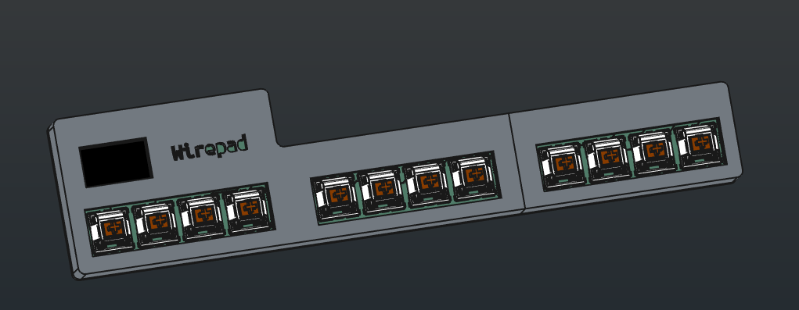
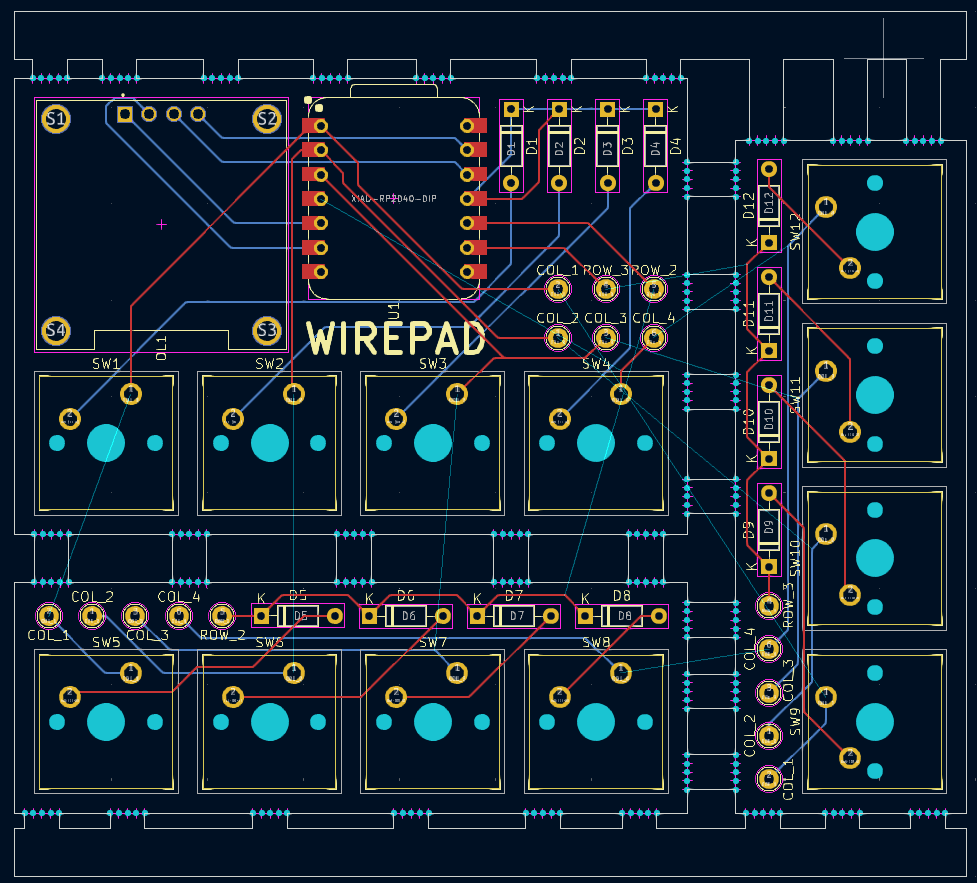
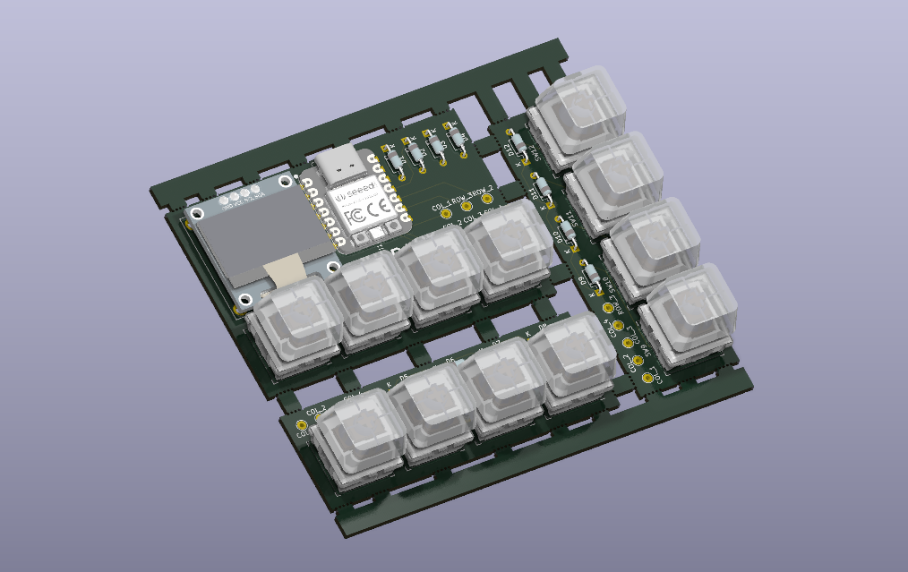
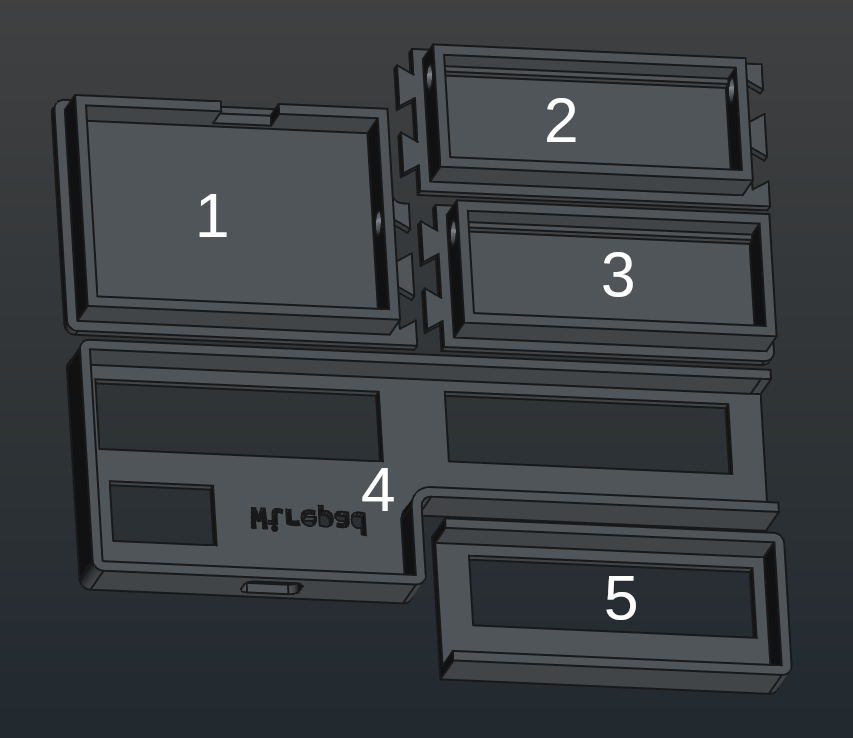
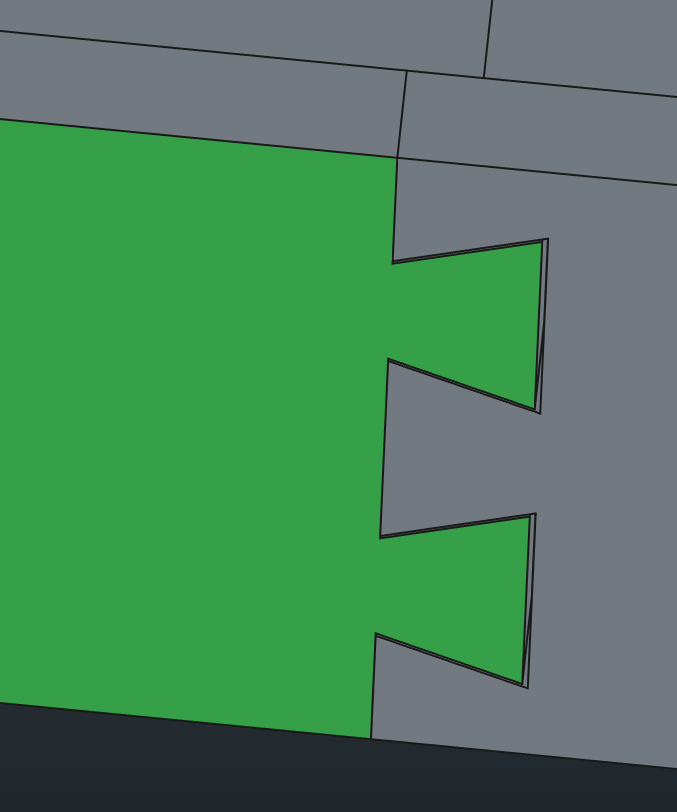

# Wirepad

This is a macropad made for [Hackpad v2](https://hackpad.hackclub.com/). The requirements were such that the PCB must not be bigger than 100x100 mm, and that the case should not exceed 200x200x100 mm, when printed.

Because I sometimes like to challenge myself, I decided to make a modular design, that would span over the 100x100 mm PCB limit: 70 + 70 + 70 = 210 mm! The PCB is a panelized PCB (using mousebites) consisting of 3 other PCBs. They will be _wired_ together using normal thin electric wires, hence the name **Wire**pad.

## Schematic

I have an OLED display, 12 keys (4 columns times 3 row), and 12 diodes.

## PCB

Dimensions: **99x90 mm**

3 total PCBs are to be manufactured as 1. Panelized using mousebites.

### DRC

The DRC doesn't pass all tests and there are some errors, however, **all the errors reported have to do with the fact that some connections remain unconnected**. **This is done on purpose** because of the manual wiring to be done later on.

## Case

Designing the case was a bit tricky. First and foremost: it's _long_. So I had to split it into 5 pieces.

Parts 1-3 are assembled together using a sort of zig-zag pattern, there is also some clearance left (because the case is 3D printed):

They also have round holes through which the wires go.

Then there is the case cover (4 and 5), which is split into two parts: one that covers the main PCB (where the XIAO is, head) and the middle part, and one that covers the other smaller PCB (tail). I, again, made sure to have some clearance between the walls of the cover and the actual case. The case cover will be held in place using glue.

The PCB will be held in place using paper and glue (I'm not kidding, I'm an origamist): I decided to go with this approach because I wanted the assembly to be as interesting and as simple as possible, while having a more personal touch.

## BOM

- 1x Seeed XIAO - RP2040 (THT)
- 1x 0.96" 4-pin I2C OLED display
- 12x 1N4148 THT diodes
- 12x MX-style switches (15x15 mm from the approved parts)
