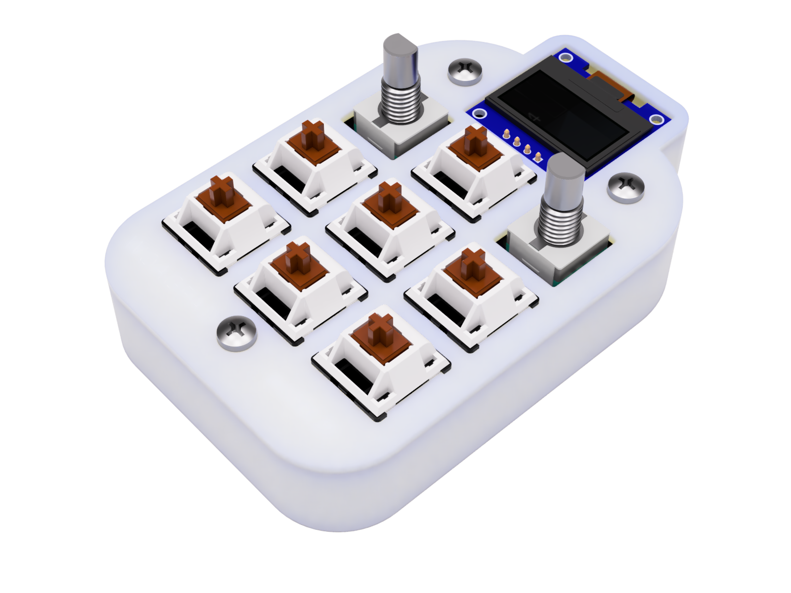
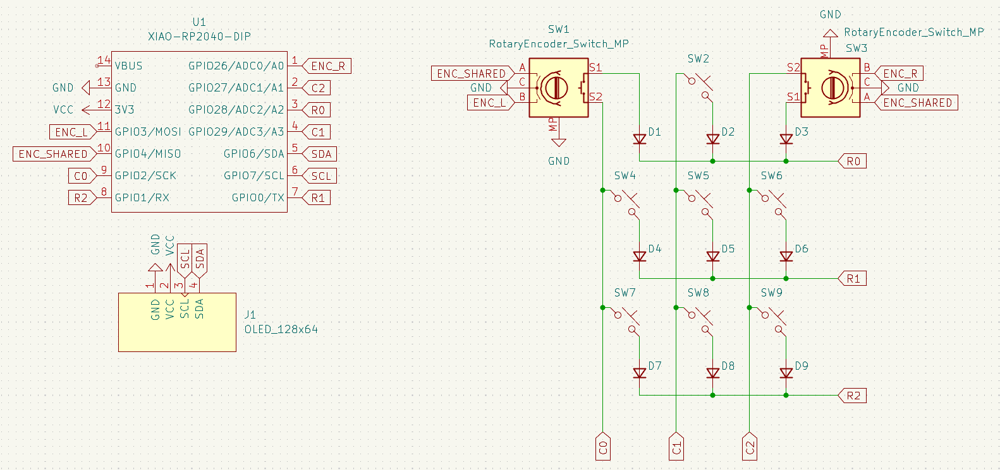
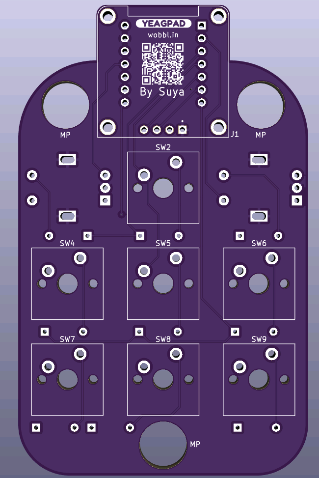
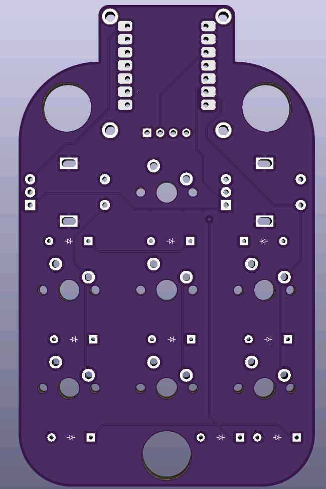
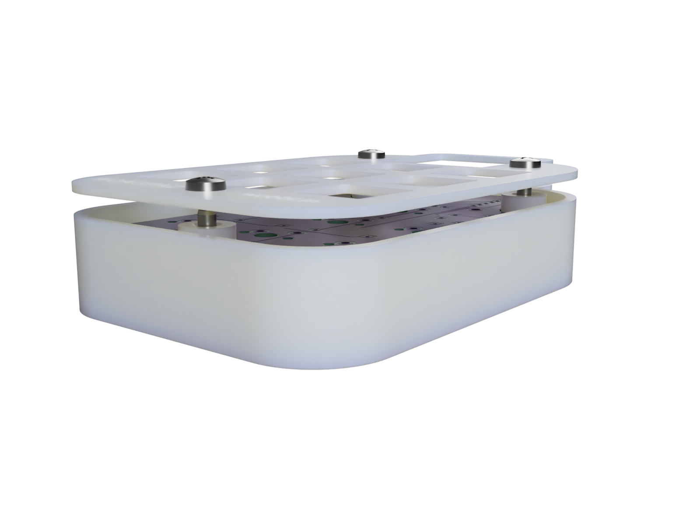

# The Woagpad

## A macropad of all time

The woagpad is a board I decided to create because a macropad
kinda just sounds fun. I really also wanted the rotary encoders
to be able to change volume and control media playback (although RMK doesn't support it yet. Eventually:tm:).

## Features

- **Rust based firmware**: Through the power of [RMK](https://haobogu.github.io/rmk), the firmware is written in 100% Rust. Crab gaming :crab:
  - [VIAL](https://get.vial.today/) support OOTB
- **128x64 OLED Display**: Display whatever the hell you want*
- **2 EC11 Rotary Encoders**: Control your volume or scroll through pages with these*
- **3x3 key matrix**: Keypad, macro, media controls, whatever the hell you want. You have 9 keys to mess around with (this includes the push buttons on the rotary encoders)

*The default rmk firmware does not support OLED display or rotary encoders yet.
Once those are implemented, the firmware will be updated to support them.
Write your own firmware to take advantage of these features!

## Design

### PCB

Bog standard PCB Schematic for a macropad.
This is actually my first design that uses a matrix
and an OLED display so that's fun.

Also yes, 2 encoders can share a pin! Neat.

|Front|Back|
|---|---|
|||

First PCB with actual mounting holes.
although in this case, the mounting holes are used
for mounting the top and bottom of the case.
See the case design for more details.

### Case

Top integrated plate + frame. Bottom half with standoffs
for heat inserts to screw the two halves together.

Also yes, the encoder holes are slightly larger than the encoders.
I have no idea how well they'll actually fit so I decided for
more tolerance than normal. It'll be fine... right?

### BOM
- 1x PCB
  - see production/gerber.zip
- 1x Case
  - see production/Top.step
  - see production/Bottom.step
- 7X Cherry MX Switches
- 7X DSA Keycaps
- 2X Rotary Encoders
- 9X 1N4148 Diodes
- 3X M3x5mx4mm Heatset inserts
- 3X M3x16mm Bolts
- 1x XIAO RP2040
- 1x 0.91" 128x64 OLED Display

## Extras
First time using [RMK](https://haobogu.github.io/rmk) for firmware. It was WAY easier compared to other firmware options.
Highly reccomend if you don't need additional features.
