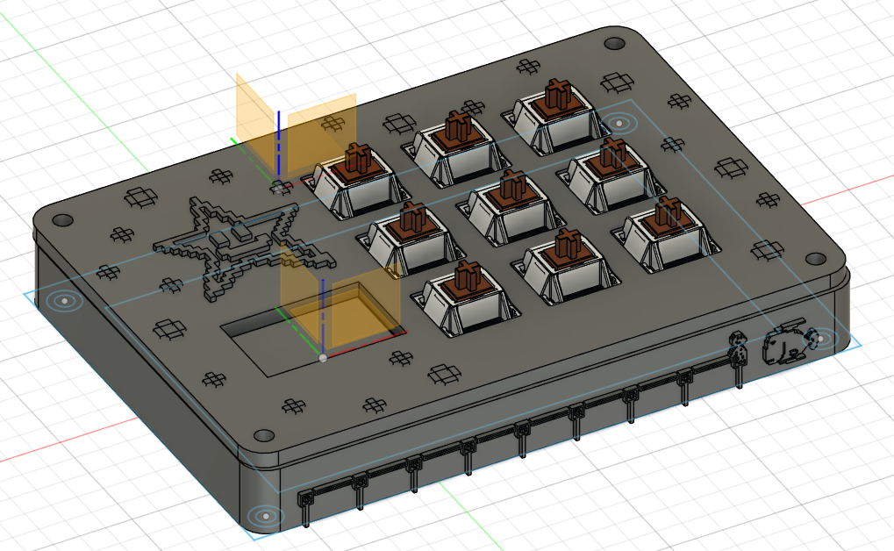
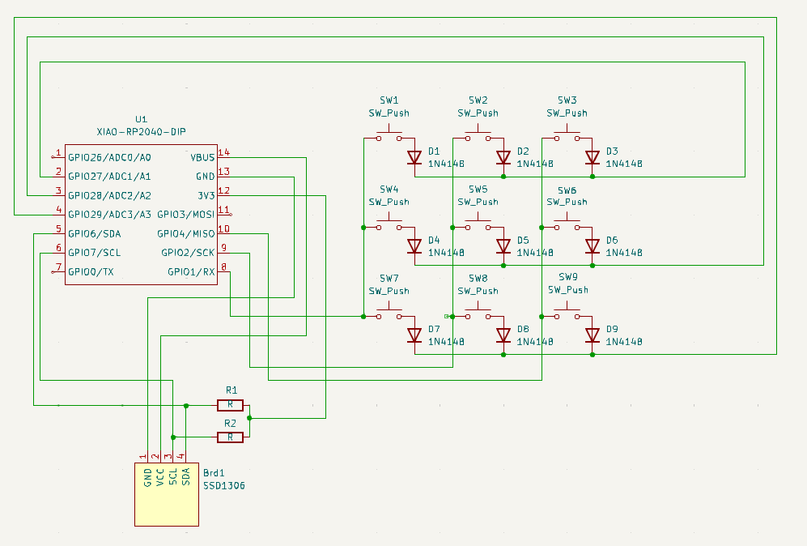
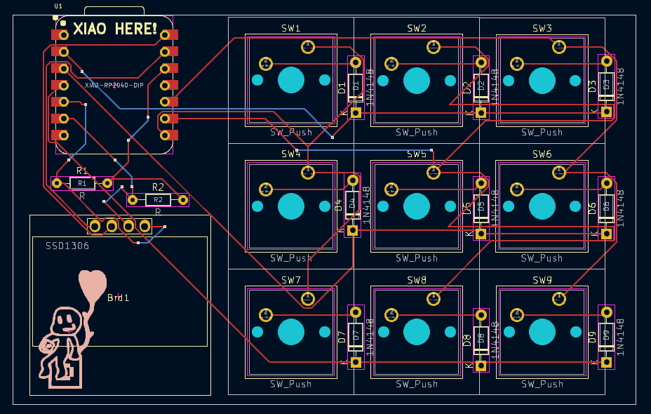

# YanPad

The YanPad is a 9 key macropad themed around Night Walk from Rhythm Tengoku. It also features a 128x64 display which displays an image of The Play-Yan!!!

# Images

### The YanPad itself!

### Schematic

### PCB

# Bill of Materials

Xiao RP2040: 1
Cherry MX switches (Blue): 9
Through-hole 1N4148 Diode: 9
0.96 inch SSD1306 OLED Display: 1
4.7kΩ Resistor: 2
PCB: 1
3D Printed Case: 1
