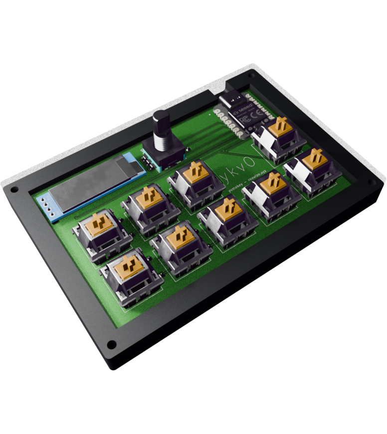
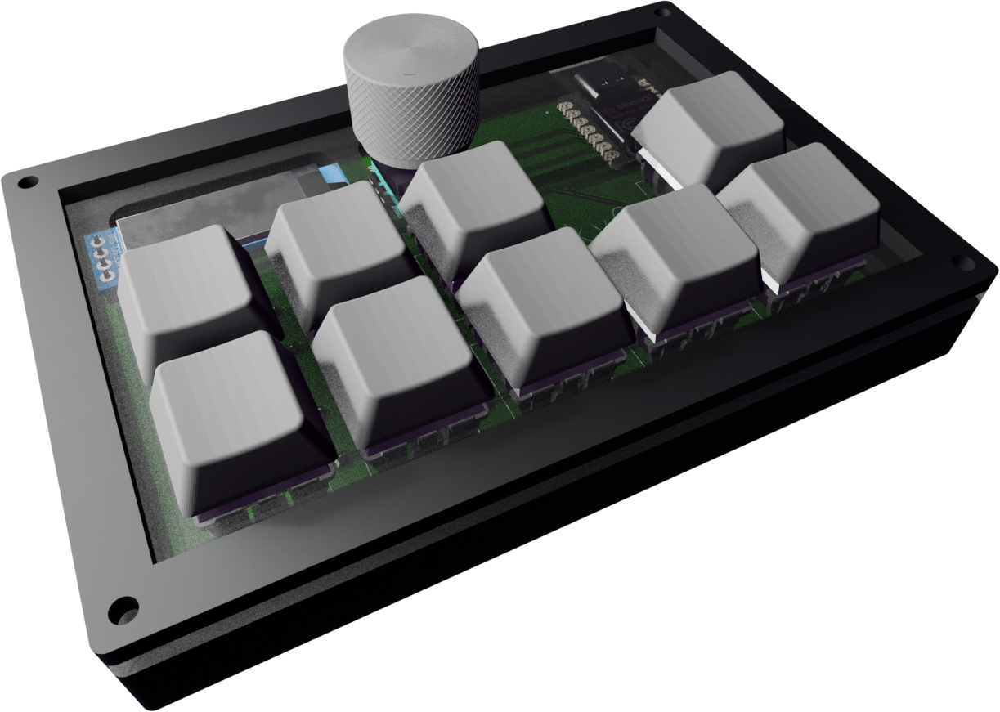

# yumekey

So named because I intend to use it for [Yume Nikki Online](https://ynoproject.net/), particularly the OLED for displaying location updates.

All of this was new to me. I have never designed a schematic, PCB, or case before, nor have I ever programmed firmware for any processor. Expectantly, it did not really quite work out, so this is all
being done super late with the likelihood that it won't be accepted at all in the end. That kind of sucks, but it's fine.

# Bill of Materials

I'd prefer if the case was printed in black filament if available, with the plate using acrylic (also if available).

| Qty | Name                                        |
| --- | ------------------------------------------- |
| 10  | 1N4148 diodes                               |
| 9   | Cherry MX switches (Gateron Milky Yellows?) |
| 1   | 128x32 I2C OLED screen                      |
| 1   | EC11 rotary encoder **+ knob**              |
| 1   | PCB (any color, preferably white)           |
| 1   | Seeed Studio XIAO RP2040                    |
