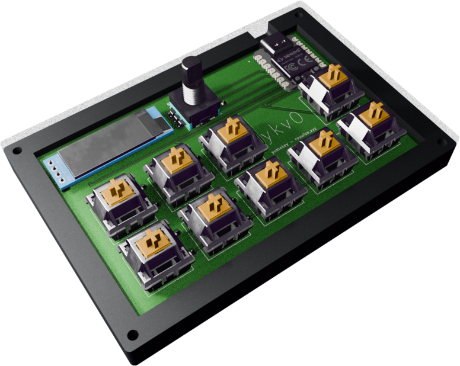
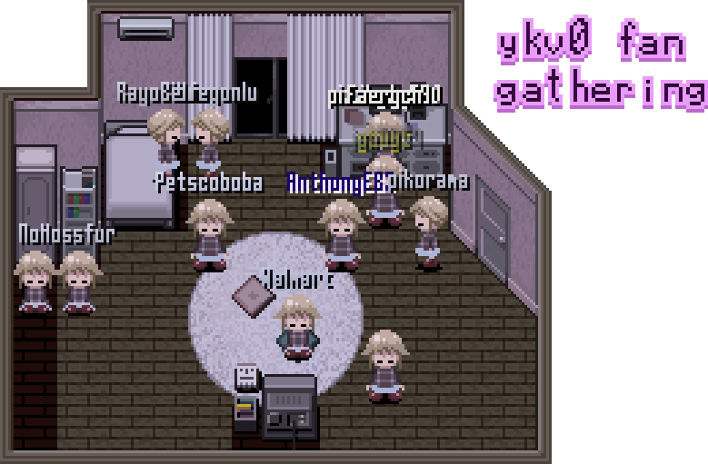
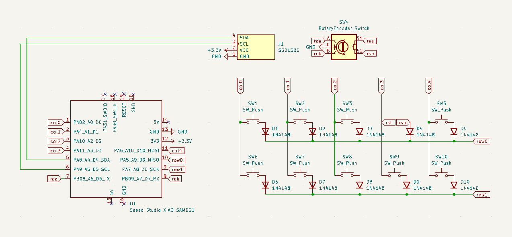
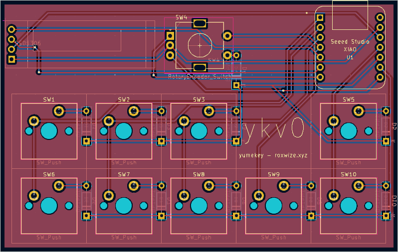

# yumekey

So named because I intend to use it for [Yume Nikki Online](https://ynoproject.net/), particularly the OLED for displaying location updates.

All of this was new to me. I have never designed a schematic, PCB, or case before, nor have I ever programmed firmware for any processor. Expectantly, it did not really quite work out (edit: IT ACTUALLY DIDSIES), but I still managed
to finish it two weeks late (edit: TWO DAYS EARLY).

(THEY'RE INSIDE YOUR COMPUTER ... AND IN YOUR KEYBOARD (which i hope is a yumekey)...)

# Screenshots

# Bill of Materials

I'd prefer if the case was printed in black filament if available, with the center key plate being white filament (or some other fancy color I guess).

| Qty | Name                                        |
| --- | ------------------------------------------- |
| 10  | 1N4148 diodes                               |
| 9   | Cherry MX switches (Gateron Milky Yellows?) |
| 1   | 128x32 I2C OLED screen                      |
| 1   | EC11 rotary encoder **+ knob**              |
| 1   | PCB (any color, preferably white)           |
| 1   | Seeed Studio XIAO RP2040                    |
