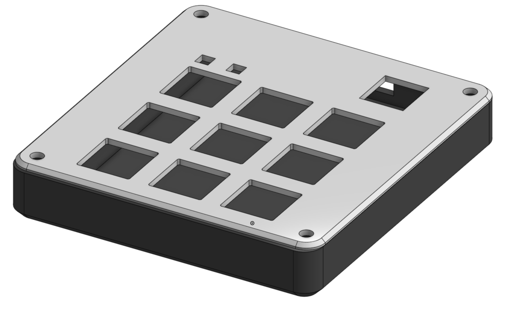
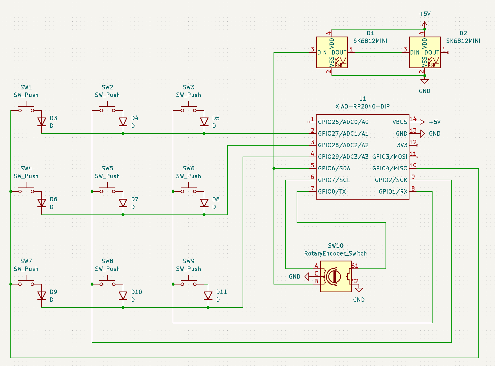
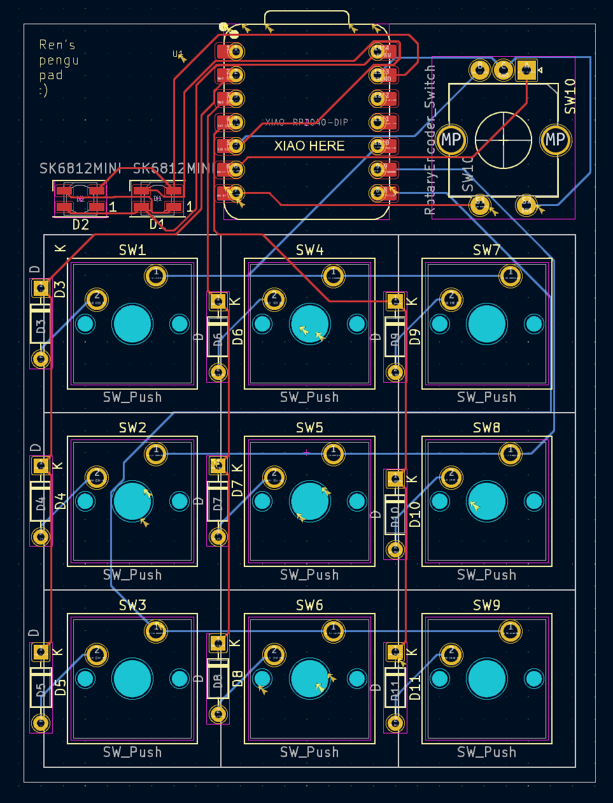

# Ren's Macropad

# Macropad

# Schematic

# PCB

# BOM
* 1 x Xiao RP2040 DIP
* 1 x EC11 Rotary encoder
* 2 x SK6812 MINI-E LEDs
* 4 x M3x16mm screws
* 4 x M3 hex nuts
* 9 x Through-hole 1N4148 Diodes
* 9 x MX-Style switches
* 9 x WHITE Blank DSA keycaps